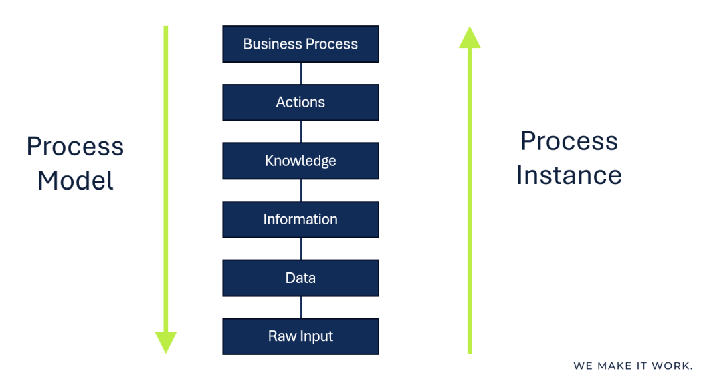
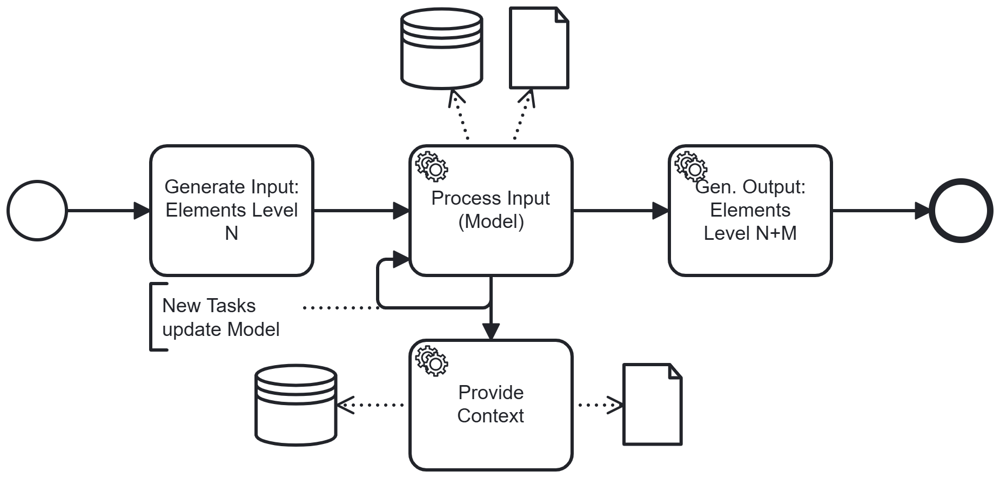
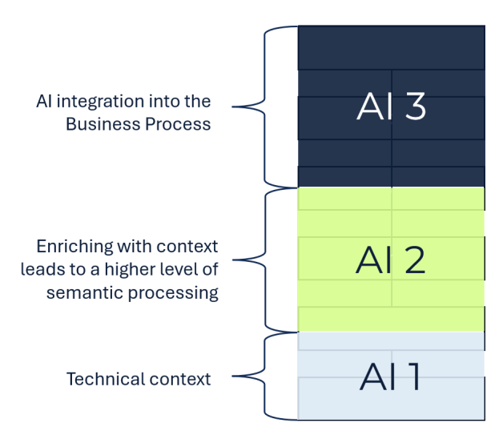
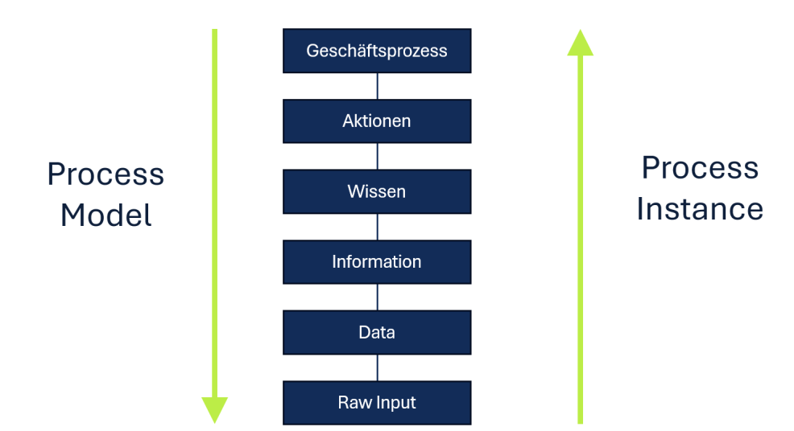
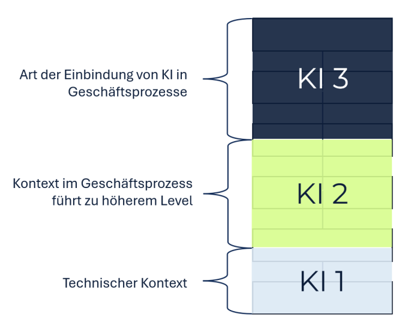

# Separation of Level

## Short Description

Each AI system in a business process operates at a clearly defined processing level. A single AI system is restricted to one of the following level groups:
- Base: level "Raw Input" to Data
- Content: levels Data, Information, and Knowledge
- Process: levels Knowledge, Actions, and Business Process.

Different level groups are handled by separate AI steps — even if the same underlying model is used.

---

## Problem / Context

Processing in business processes can be described along a hierarchy of abstraction levels:

| Level | Description |
|---|---|
| **Raw Input** | Technical input with no business semantics (e.g. speech signal, handwriting scan) |
| **Data** | Structured values extracted from raw input (e.g. digits, words) |
| **Information** | Data placed in business context (e.g. a digit sequence identified as a customer number) |
| **Knowledge** | Information enriched with interpretation and rules (e.g. assessing whether a complaint is justified) |
| **Actions** | Derived decisions or outputs that drive the next process step |
| **Business Process** | Orchestration of the above into a coherent, compliant workflow |

Classical IT systems reliably handle the lower levels (Raw Input → Data → Information). Equally, the upper levels can be covered (Actions → Business Process orchestration). AI introduces a fundamentally new capability: it can operate at the **Knowledge** level — and can in principle span all levels in a single step. (E.g. from a speech input, identify the contained data and information, assess it, derive actions, and initiate them.)

This creates compliance risks:
- An AI that jumps multiple levels in one step is harder to test. Test cases must cover all levels simultaneously, and when errors occur, it is difficult to determine at which level they originated.
- AI always applies its trained knowledge — even when processing lower levels. This implicit knowledge influence can introduce unexpected semantics.
- Model updates or drift affect all levels simultaneously, making it harder to isolate the source of changed behaviour.

---

## Solution / Structure

Assign each AI step a single, clearly defined level group. It operates only within that group. In practice, this typically means: the AI system receives input at level N and produces output at level N+1 or N+2 (e.g. deriving both Information and Knowledge from Data). AI steps spanning more than one level group are not designed.

Key design principles:
- **Clear level transition**: Each AI invocation handles one well-defined transformation (e.g. Raw Input → Data, or Knowledge → Action).
- **Explicit intermediate outputs**: The output of each AI step is a defined artifact that can be inspected, tested, and validated independently.
- **Separate technical and business context**: AI steps operating at the technical level (Raw Input, Data) should not have access to full business context. Business-context AI steps operate at higher levels only.
- **Same model, separate processing steps**: All AI steps may be based on the same underlying LLM. What matters is the separation of steps, not necessarily the use of different models.

### BPMN Diagram

**Figure 1 — Level structure**

The processing hierarchy from Raw Input to Business Process. Each level represents a distinct degree of abstraction and semantic enrichment.

**Figure 2 — BPMN: multi-level processing by AI**

A single AI step spanning multiple levels in one pass — the problematic baseline that this pattern addresses. Without level separation, errors are hard to isolate and the system is difficult to test.

**Figure 3 — BPMN: level processing distributed across AI steps**

Three sequential AI steps, each restricted to one level group. AI 1 handles technical input processing (Raw Input → Data). AI 2 enriches data with business context (Data+Information → Knowledge). AI 3 derives actions and drives the business process forward (Knowledge → Actions+Business Process).

---

## Related Patterns & Origin

This pattern is an AI-specific adaptation of the following established patterns:

| Origin Pattern | Relationship |
|---|---|
| **Chain of Responsibility** (Software Design) | Sequential delegation of processing responsibility, each handler operating at its designated level |
| **Layered Architecture** | Strict separation of concerns across abstraction layers; each layer only communicates with adjacent layers |
| **Business Process Management (BPM)** | Alignment of AI processing steps with process model and process instance levels |

**Validated in case study**: KIMONA (complaint processing) — processing traversed all levels from Raw Input (handwritten letter scan) to business process actions (response generation). Separating steps by level confirmed: level jumps are limited, errors are easier to isolate, and the system is more amenable to testing and model updates.

---
---

# Separation of Level

## Kurzbeschreibung

Jedes KI-System in einem Geschäftsprozess operiert auf klar definierten Verarbeitungsleveln. Ein einzelnes KI-System beschränkt sich auf eine der folgenden Gruppen von Leveln:
- Basis: Level "Raw Input" zu Data
- Inhalt: Level Data, Information und Wissen
- Prozess: Wissen, Aktionen und Geschäftsprozess.

Unterschiedliche Level-Gruppen werden durch separate KI-Schritte bearbeitet.

---

## Problem / Kontext

Die Verarbeitung in Geschäftsprozessen lässt sich anhand einer Hierarchie von Abstraktionsleveln beschreiben:

| Level                | Beschreibung                                                                                                     |
| -------------------- | ---------------------------------------------------------------------------------------------------------------- |
| **Raw Input**        | Technische Eingabe ohne Geschäftssemantik (z.B. Sprachsignal, Handschrift-Scan)                                  |
| **Data**             | Aus dem Rohinput extrahierte strukturierte Werte (z.B. Ziffern, Wörter)                                          |
| **Information**      | Daten im Geschäftskontext eingeordnet (z.B. eine Ziffernfolge als Kundennummer identifiziert)                    |
| **Wissen**           | Mit Interpretation und Regeln angereicherte Informationen (z.B. Beurteilung, ob eine Reklamation berechtigt ist) |
| **Aktionen**         | Abgeleitete Entscheidungen oder Ausgaben, die den nächsten Prozessschritt steuern                                |
| **Geschäftsprozess** | Orchestrierung der obigen Level zu einem kohärenten, compliance-konformen Ablauf                                 |

Klassische IT-Systeme verarbeiten die unteren Level zuverlässig (Raw Input → Data → Information). Ebenso können die oberen Level abgedeckt werden (Aktionen → Geschäftsprozess-Orchestrierung). KI bringt eine fundamental neue Fähigkeit: Sie kann auf dem **Wissens**-Level operieren. Damit kann sie alle Level abdecken — und prinzipiell alle Level in einem einzigen Schritt überspannen. (Z.B. aus einer Spracheingabe die darin enthaltenen Daten und Informationen identifizieren, bewerten, Aktionen ableiten und initiieren.)

Dies erzeugt Compliance-Risiken:
- Eine KI, die in einem Schritt mehrere Level überspringt, ist schwerer testbar. Testfälle müssen alle Level gleichzeitig abdecken, und bei Fehlern ist schwer festzustellen, auf welchem Level sie entstanden sind.
- KI wendet ihr trainiertes Wissen immer an — auch bei der Verarbeitung unterer Level. Dieser implizite Wissenseinfluss kann unerwartete Semantik einbringen.
- Modell-Updates oder Model Drift beeinflussen alle Level gleichzeitig, was die Fehlerursache schwerer isolierbar macht.

---

## Lösung / Struktur

Jedem KI-Schritt wird eine einzelne, klar definierte Level-Gruppe zugewiesen. Er operiert nur innerhalb dieser Gruppe. In der Regel bedeutet dies: Das KI-System empfängt Input auf Level N und produziert Output auf Level N+1 oder N+1 (z.B. leitet es aus Daten dann Informationen und Wissen ab). Es werden keine KI-Schritte designed, die mehr als eine  Level-Gruppe überspannen.

Wesentliche Gestaltungsprinzipien:
- **Klare Level-Transition**: Jeder KI-Aufruf bearbeitet eine klar definierte Transformation (z.B. Raw Input → Data, oder Wissen → Aktion).
- **Explizite Zwischenergebnisse**: Das Ergebnis jedes KI-Schritts ist ein definiertes Artefakt, das unabhängig geprüft, getestet und validiert werden kann.
- **Technischen und Geschäftskontext trennen**: KI-Schritte auf technischem Level (Raw Input, Data) sollten keinen Zugriff auf den vollständigen Geschäftskontext haben. Geschäftskontext-KI-Schritte operieren ausschließlich auf höheren Leveln.
- **Gleiches Modell, separate Verarbeitungsschritte**: Alle KI-Schritte können auf demselben zugrundeliegenden LLM basieren. Entscheidend ist die Trennung der Schritte, nicht notwendigerweise der Einsatz unterschiedlicher Modelle.

### BPMN-Darstellung

**Abbildung 1 — Level-Struktur**

Die Verarbeitungshierarchie von Raw Input bis Geschäftsprozess. Jedes Level repräsentiert einen eigenen Abstraktionsgrad und eine eigene semantische Anreicherung.

**Abbildung 2 — BPMN: Verarbeitung mehrerer Level durch KI**

Ein einzelner KI-Schritt überspannt mehrere Level in einem Durchgang — die problematische Ausgangslage, die dieses Pattern adressiert. Ohne Level-Trennung sind Fehler schwer isolierbar und das System schwer testbar.

**Abbildung 3 — BPMN: Aufteilung der Level-Bearbeitung auf KI-Schritte**

Drei sequenzielle KI-Schritte, jeder auf eine Level-Gruppe beschränkt. KI 1 verarbeitet die technische Eingabe (Raw Input → Data). KI 2 reichert Daten mit Geschäftskontext an (Data+Information → Wissen). KI 3 leitet Aktionen ab und steuert den Geschäftsprozess weiter (Wissen → Aktionen+Geschäftsprozess).

---

## Verwandte Pattern & Herkunft

Dieses Pattern ist eine KI-spezifische Ausprägung der folgenden etablierten Pattern:

| Herkunfts-Pattern | Bezug |
|---|---|
| **Chain of Responsibility** (Software Design) | Sequentielle Weitergabe der Verarbeitungsverantwortung; jeder Handler operiert auf seinem zugewiesenen Level |
| **Layered Architecture** | Strikte Trennung nach Abstraktionsschichten; jede Schicht kommuniziert nur mit benachbarten Schichten |
| **Business Process Management (BPM)** | Ausrichtung der KI-Verarbeitungsschritte an Prozessmodell und Prozessinstanz-Ebenen |

**Validiert im Anwendungsfall**: KIMONA (Reklamationsbearbeitung) — die Verarbeitung durchlief alle Level von Raw Input (Handschrift-Scan) bis zu Geschäftsprozess-Aktionen (Antwortgenerierung). Die Trennung nach Leveln bestätigte: Level-Sprünge werden begrenzt, Fehler sind leichter isolierbar, das System ist besser testbar.
