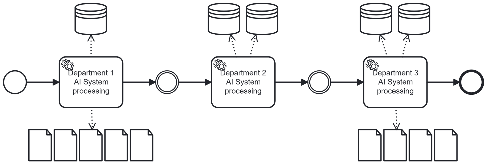

# Separation of Concern

## Short Description

Separate responsibilities are handled by separate AI systems. Each AI system in a business process operates within a clearly defined data scope and area of responsibility. AI systems do not share data or access each other's data domains directly.

---

## Problem / Context

Business processes typically traverse multiple areas of responsibility (e.g. departments from sales to service). When an AI system is intended to cover a broad range of tasks in a business process, it typically needs access to different data — customer data, contract data, internal knowledge bases, etc. Without deliberate design, AI systems may accumulate broad data access, either through direct coupling or through shared data flows.

This creates several compliance risks:
- Data that an AI system should not access may inadvertently be passed to it — either by another AI or via a shared context (e.g. a shared prompt or data pipeline).
- Data from different domains is often not fully consistent with each other. AI systems with access to multiple such data domains may produce inconsistent or semantically incorrect results.
- Errors become harder to isolate: when a problem occurs, it is difficult to determine which source and which data access caused it.

The broader the data access of an AI system, the greater its potential compliance impact and the harder it is to audit, test, and control.

---

## Solution / Structure

Assign each AI system a dedicated, bounded data scope that corresponds to the organisational or functional unit it serves. AI systems must not access data outside their assigned scope. Data handovers between AI systems are controlled and explicitly defined — not implicit.

Key design principles:
- **One AI per concern**: Each AI system handles a clearly defined task within one semantic domain.
- **No cross-AI data sharing**: Data does not flow freely between AI systems. Any handover is an explicit, controlled interface.
- **Consistent terminology per scope**: Each AI operates within a consistent semantic context, reducing misinterpretation at boundaries.
- **Independent lifecycle**: AI systems can be updated, retrained, or replaced independently without affecting other AI systems in the process.

A Facade or Gateway component can coordinate the handovers between AI systems without exposing data across scopes.

### BPMN Diagram

Each process step is handled by an AI system with access only to the data scope relevant to its department or functional unit. Results are passed forward as controlled outputs — not raw data.

---

## Related Patterns & Origin

This pattern is an AI-specific adaptation of the following established patterns:

| Origin Pattern | Relationship |
|---|---|
| **Separation of Concerns** (Software Design) | Direct conceptual origin — partition responsibilities into distinct, non-overlapping areas |
| **Policy Enforcement Pattern** | Enforce access rules at the boundary of each AI system's data scope |
| **Chain of Responsibility** | Sequential handover of processing responsibility between AI systems |
| **Modular Architecture** | Each AI system as an independently deployable module |
| **Service-Oriented Architecture (SOA)** | AI systems as services with defined interfaces and data contracts |
| **Two-Speed Architecture** | Different AI systems may evolve at different speeds without coupling |
| **Business Process Management (BPM)** | Alignment of AI responsibilities with organisational units and process roles |

**Validated in case study**: KIMONA (complaint processing) — AI systems for customer interaction and internal data processing were kept in separate concerns, preventing customer-facing AI from accessing sensitive back-office data.

---
---

# Separation of Concern

## Kurzbeschreibung

Für separate Zuständigkeiten werden separate KI eingesetzt. Jedes KI-System im Geschäftsprozess operiert innerhalb eines klar definierten Datenbestands- und Zuständigkeits-Bereich. KI-Systeme greifen nicht direkt auf den Datenbereich des jeweils anderen zu.

---

## Problem / Kontext

Geschäftsprozesse durchlaufen in der Regel verschiedene Zuständigkeitsbereiche (z.B. Abteilungen von Vertrieb bis Service). Wenn ein KI-System ein breites Aufgabenspektrum in einem Geschäftsprozess abdecken soll, benötigt es typischerweise Zugriff auf unterschiedliche Daten — Kundendaten, Vertragsdaten, interne Wissensdatenbanken usw. Ohne bewusstes Design können KI-Systeme breiten Datenzugriff akkumulieren, entweder durch direkte Kopplung oder durch gemeinsame Datenflüsse.

Dies erzeugt mehrere Compliance-Risiken:
- Daten, auf die ein KI-System keinen Zugriff haben sollte, können ihm versehentlich weitergegeben werden — durch ein anderes KI-System oder über einen gemeinsamen Kontext (z.B. einen gemeinsamen Prompt oder eine gemeinsame Datenpipeline).
- Datenbestände aus unterschiedlichen Bereichen sind in der Regel leider nicht vollständig konsistent zueinander. KI-Systeme, die auf mehrere solcher  Datenbereichen Zugriff haben, können inkonsistente oder semantisch fehlerhafte Ergebnisse produzieren.
- Fehler werden schwerer lokalisierbar: Tritt ein Problem auf, ist schwer festzustellen, welche Quelle und welcher Datenzugriff es verursacht hat.

Je breiter der Datenzugriff eines KI-Systems, desto größer sein potenzieller Compliance-Impact und desto schwerer ist es, das System zu auditieren, zu testen und zu kontrollieren.

---

## Lösung / Struktur

Jedem KI-System wird ein dedizierter, begrenzter Datenbestand zugewiesen, der der organisatorischen oder funktionalen Einheit entspricht, die es bedient. KI-Systeme dürfen nicht auf Daten außerhalb ihres zugewiesenen Bereichs zugreifen. Datenübergaben zwischen KI-Systemen sind kontrolliert und explizit definiert — nicht implizit.

Wesentliche Gestaltungsprinzipien:
- **Eine KI pro Zuständigkeit**: Jedes KI-System bearbeitet eine klar definierte Aufgabe innerhalb eines semantischen Bereichs.
- **Keine bereichsübergreifende Datenweitergabe**: Daten fließen nicht frei zwischen KI-Systemen. Jede Übergabe ist eine explizite, kontrollierte Schnittstelle.
- **Einheitliche Terminologie pro Bereich**: Jede KI operiert in einem konsistenten semantischen Kontext, was Missinterpretationen an Übergabepunkten reduziert.
- **Unabhängiger Lebenszyklus**: KI-Systeme können unabhängig voneinander aktualisiert, neu trainiert oder ersetzt werden, ohne andere KI-Systeme im Prozess zu beeinflussen.

Eine Fassade oder ein Gateway kann die Übergaben zwischen KI-Systemen koordinieren, ohne Daten über Bereiche hinweg freizugeben.

### BPMN-Darstellung

Jeder Prozessschritt wird durch ein KI-System bearbeitet, das nur auf den Datenbestand seiner Abteilung oder funktionalen Einheit zugreift. Ergebnisse werden als kontrollierte Ausgaben weitergegeben — nicht als Rohdaten.

---

## Verwandte Pattern & Herkunft

Dieses Pattern ist eine KI-spezifische Ausprägung der folgenden etablierten Pattern:

| Herkunfts-Pattern | Bezug |
|---|---|
| **Separation of Concerns** (Software Design) | Direkter konzeptioneller Ursprung — Zuständigkeiten in getrennte, nicht überlappende Bereiche aufteilen |
| **Policy Enforcement Pattern** | Zugriffsregeln an der Grenze des Datenbereichs jedes KI-Systems durchsetzen |
| **Chain of Responsibility** | Sequentielle Weitergabe der Verarbeitungsverantwortung zwischen KI-Systemen |
| **Modular Architecture** | Jedes KI-System als unabhängig deploybare Einheit |
| **Service-Oriented Architecture (SOA)** | KI-Systeme als Services mit definierten Schnittstellen und Datenverträgen |
| **Two-Speed Architecture** | Verschiedene KI-Systeme können sich mit unterschiedlichen Geschwindigkeiten weiterentwickeln |
| **Business Process Management (BPM)** | Ausrichtung der KI-Zuständigkeiten an organisatorischen Einheiten und Prozessrollen |

**Validiert im Anwendungsfall**: KIMONA (Reklamationsbearbeitung) — KI-Systeme für Kundenkommunikation und interne Datenverarbeitung wurden in getrennten Zuständigkeitsbereichen gehalten, um zu verhindern, dass die kundenseitige KI auf sensible Back-Office-Daten zugreift.
