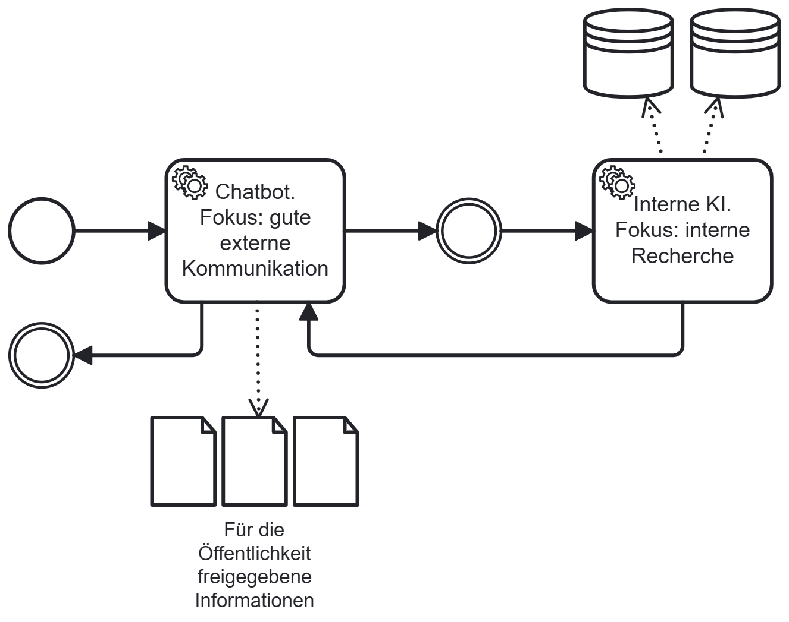

# Split Chatbot

## Short Description

External customer-facing communication and internal data research are handled by two separate AI systems. The external AI has no access to restricted internal data — it cannot inadvertently disclose what it does not know.

---

## Problem / Context

Chatbot systems that interact with external users (customers, partners, citizens) often need to draw on internal, access-restricted data to answer queries correctly. A naive implementation uses a single AI that has access to both the conversational interface and the internal data stores.

This creates compliance risks:
- An AI with access to sensitive internal data may inadvertently include restricted information in its external responses — through hallucination, prompt injection, or unexpected generalisation.
- The same AI must simultaneously be optimised for fluent, natural communication and for accurate, reliable data retrieval — two objectives that are difficult to balance and test together.
- When the AI is updated to improve conversational quality, the update may also affect internal data handling — and vice versa. There is no clean separation of change risk.
- Testing compliance is harder: verifying that no restricted data leaks into external responses requires exhaustive test coverage across the full combined system.

---

## Solution / Structure

Split the chatbot into two AI systems with distinct responsibilities and data access:

**Frontend AI** (external, customer-facing):
- Handles the conversational interface: understanding customer queries, formulating responses.
- Has **no direct access** to internal or access-restricted data.
- Receives only pre-filtered, approved information from the Backend AI.
- Can be updated and iterated rapidly by a Service Centre or Online Channel team using agile methods — without risking data leakage, since it has nothing sensitive to leak.

**Backend AI** (internal, back-office):
- Handles internal data research: querying internal systems, retrieving relevant information, interpreting results.
- Applies a **data filter** before returning results to the Frontend AI: only information approved for external disclosure is passed forward.
- Is updated and released more conservatively, with dedicated testing — including data protection review — before any new version is activated.

A controlled, explicit interface between the two AI systems defines what information may pass from backend to frontend.

**Important empirical finding**: A single LLM instance can technically handle both roles in sequential steps with an explicit intermediate output. However, this requires very high test effort to verify the separation reliably — and to keep it reliable as the model is continuously trained. For practical compliance reasons, separate AI instances are recommended.

### BPMN Diagram

The Frontend AI handles the customer interaction and formulates the external response. The Backend AI conducts internal research, filters results, and returns only approved information to the Frontend AI.

---

## Related Patterns & Origin

This pattern is an AI-specific adaptation of the following established patterns:

| Origin Pattern | Relationship |
|---|---|
| **Separation of Concerns** (Software Design) | Direct conceptual origin — external communication and internal research as separate, non-overlapping concerns |
| **Two-Speed Architecture** | Frontend AI: fast, agile, UX-optimised. Backend AI: slow, rigorous, correctness-optimised |
| **Facade Pattern** | The controlled interface between Frontend and Backend AI acts as a facade, hiding internal complexity and data |
| **Policy Enforcement Pattern** | The Backend AI enforces data disclosure policies before passing results forward |
| **Modular Architecture** | Each AI component is independently deployable and trainable |

**Validated in case study**: KIMONA (complaint processing) — the system was structured as a Split Chatbot, separating customer-facing response generation from internal data research. Empirical finding: the same result quality was achievable with one LLM instance as with two, but maintaining reliable separation under continuous training requires significantly higher test effort and a dedicated test team with data protection involvement.

---
---

# Split Chatbot

## Kurzbeschreibung

Bei einem Chatbot werden externe, kundenseitige Kommunikation und interne Datenrecherche durch zwei separate KI-Systeme übernommen. Die externe KI hat keinen Zugriff auf eingeschränkte interne Daten — sie kann nicht versehentlich herausgeben, was sie nicht kennt.

---

## Problem / Kontext

Chatbot-Systeme, die mit externen Nutzern (Kunden, Partnern, Bürgern) interagieren, müssen oft auf interne, zugriffsbeschränkte Daten zurückgreifen, um Anfragen korrekt zu beantworten. Eine naive Implementierung nutzt eine einzige KI, die sowohl auf die Gesprächsschnittstelle als auch auf die internen Datenspeicher zugreift.

Dies erzeugt Compliance-Risiken:
- Eine KI mit Zugriff auf sensible interne Daten kann diese versehentlich in externen Antworten preisgeben — durch Halluzination, Prompt Injection oder unerwartete Generalisierung.
- Dieselbe KI muss gleichzeitig für flüssige, natürliche Kommunikation und für präzise, zuverlässige Datenrecherche optimiert werden — zwei Ziele, die schwer gemeinsam zu testen sind.
- Wenn die KI aktualisiert wird, um die Kommunikationsqualität zu verbessern, kann das Update auch die interne Datenverarbeitung beeinflussen — und umgekehrt. Es gibt keine saubere Trennung des Änderungsrisikos.
- Das Testen der Compliance ist schwieriger: Zu prüfen, dass keine eingeschränkten Daten in externe Antworten einfließen, erfordert erschöpfende Testabdeckung über das gesamte kombinierte System.

---

## Lösung / Struktur

Den Chatbot in zwei KI-Systeme mit getrennten Zuständigkeiten und Datenzugriffen aufteilen:

**Frontend-KI** (extern, kundenseitig):
- Übernimmt die Gesprächsschnittstelle: Kundenanfragen verstehen, Antworten formulieren.
- Hat **keinen direkten Zugriff** auf interne oder zugriffsbeschränkte Daten.
- Erhält von der Backend-KI ausschließlich vorgefiltertes, freigegebenes Informationsmaterial.
- Kann schnell und iterativ durch ein Service-Center- oder Online-Channel-Team mit agilen Methoden aktualisiert werden — ohne Datenleck-Risiko, da die Frontend-KI keine sensiblen Daten kennt.

**Backend-KI** (intern, Backoffice):
- Übernimmt die interne Datenrecherche: interne Systeme abfragen, relevante Informationen abrufen, Ergebnisse interpretieren.
- Wendet vor der Rückgabe an die Frontend-KI einen **Datenfilter** an: Nur für die externe Weitergabe freigegebene Informationen werden weitergeleitet.
- Wird konservativer aktualisiert und freigegeben, mit dediziertem Test-Team — einschließlich Datenschutz-Einbindung — vor jeder Aktivierung einer neuen Version.

Eine kontrollierte, explizite Schnittstelle zwischen den beiden KI-Systemen legt fest, welche Informationen vom Backend an das Frontend weitergegeben werden dürfen.

### BPMN-Darstellung

Die Frontend-KI übernimmt die Kundeninteraktion und formuliert die externe Antwort. Die Backend-KI führt die interne Recherche durch, filtert die Ergebnisse und gibt nur freigegebene Informationen an die Frontend-KI zurück.

---

## Verwandte Pattern & Herkunft

Dieses Pattern ist eine KI-spezifische Ausprägung der folgenden etablierten Pattern:

| Herkunfts-Pattern | Bezug |
|---|---|
| **Separation of Concerns** (Software Design) | Direkter konzeptioneller Ursprung — externe Kommunikation und interne Recherche als getrennte, nicht überlappende Zuständigkeiten |
| **Two-Speed Architecture** | Frontend-KI: schnell, agil, UX-optimiert. Backend-KI: langsam, rigoros, korrektheitsorientiert |
| **Facade Pattern** | Die kontrollierte Schnittstelle zwischen Frontend- und Backend-KI wirkt als Fassade, die interne Komplexität und Daten verbirgt |
| **Policy Enforcement Pattern** | Die Backend-KI setzt Datenweitergabe-Richtlinien durch, bevor Ergebnisse weitergeleitet werden |
| **Modular Architecture** | Jede KI-Komponente ist unabhängig deploybar und trainierbar |

**Validiert im Anwendungsfall**: KIMONA (Reklamationsbearbeitung) — das System wurde als Split Chatbot strukturiert, mit getrennter kundenseitiger Antwortgenerierung und interner Datenrecherche. Empirische Erkenntnis: Mit einer LLM-Instanz war dieselbe Ergebnisqualität erreichbar wie mit zwei, jedoch erfordert die Aufrechterhaltung einer zuverlässigen Trennung unter kontinuierlichem Training erheblich höheren Testaufwand und ein dediziertes Test-Team mit Datenschutz-Einbindung.
