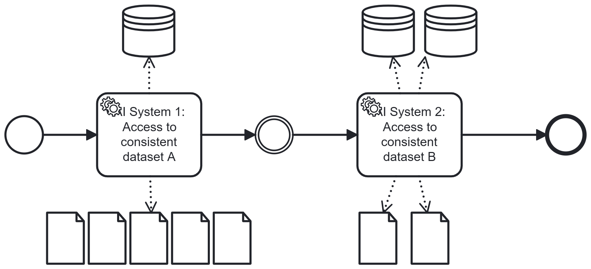

# Semantic Access

## Short Description

Data sources made available to an AI system — whether through RAG, fine-tuning, or API access — are selected exclusively from sources that are semantically consistent with each other. Mixed or ambiguous terminology across sources is prevented at the point of data access.

---

## Problem / Context

AI systems in business processes are routinely enriched with enterprise-specific knowledge to improve their relevance and accuracy. This enrichment happens through several mechanisms:

- **Fine-tuning**: Training the model on enterprise-specific data
- **RAG (Retrieval-Augmented Generation)**: Dynamically retrieving relevant documents or records and prepending them to the prompt before the AI processes the query
- **API access**: Allowing AI agents to query live systems and databases

Each of these mechanisms introduces a risk: enterprise data is rarely uniform in its terminology. Different departments, systems, or teams may use the same term to mean different things — or different terms to mean the same thing.

Examples of semantic ambiguity in enterprise data:
- The term *"customer"* may refer to an end user in one data source and to a corporate client in another.
- The term *"test"* may refer to a test case, a test environment, or a test result — depending on context.
- A *"transaction"* may be a financial transaction in one system and a database operation in another.

When an AI receives data from semantically inconsistent sources — particularly with limited context as is typical in RAG — it cannot reliably distinguish between these meanings. This leads to a specific error class: **faulty term mapping**, where the AI applies the meaning from one source to data from another.

The fewer tokens of context the AI receives (as is common in RAG), the more critical semantic consistency of the provided sources becomes.

---

## Solution / Structure

Before any data is provided to an AI system, a **Semantic Access Router** validates that all selected sources belong to a semantically consistent domain. Sources that use conflicting or ambiguous terminology for the same concepts are excluded from the data set provided to the AI.

Key design principles:
- **Consistent terminology within scope**: All data sources accessible to a given AI step must use the same terminology for the same concepts.
- **Domain-based source selection**: When retrieving data via RAG, only sources from the relevant semantic domain are included. Sources from other domains — even if they contain topically related content — are excluded if their terminology is inconsistent.
- **Explicit domain boundaries**: The semantic domains are defined and maintained as part of the enterprise data architecture. Each AI system operates within one domain.
- **Separation from Separation of Concern**: While Separation of Concern focuses on which AI system accesses which data *scope* (organisational units), Semantic Access focuses on the *terminological consistency* within that scope.

This pattern is also applicable when AI agents access data via APIs: API results should be drawn from systems that share consistent terminology with the rest of the AI's data context.

### BPMN Diagram

A Semantic Access Router filters available data sources before they are provided to the AI system. Only sources from the semantically consistent domain are passed through. Sources with conflicting terminology are blocked, even if they are topically relevant.

---

## Related Patterns & Origin

This pattern is an AI-specific adaptation of the following established patterns:

| Origin Pattern | Relationship |
|---|---|
| **Separation of Concern** (AI-EAIP #2) | Semantic Access refines Separation of Concern: not just *which* data a scope contains, but *how consistently* the terminology within it is used |
| **Policy Enforcement Pattern** | The Semantic Access Router enforces terminological consistency as a policy at data retrieval time |
| **Modular Architecture** | Each semantic domain corresponds to a module with defined and consistent internal vocabulary |
| **Service-Oriented Architecture (SOA)** | Data services expose semantically consistent interfaces; cross-domain data is not mixed |

**Validated in case study**: ISA (support assistant with AI-based compliance monitoring) — the AI system processed queries against enterprise data sources. Empirical findings:
- With rich context, the model could reliably distinguish between different meanings of the same term (e.g. "customer" as end user vs. "customer" as the company using ISA).
- With limited context (typical for RAG), the model failed to reliably distinguish between "test case" and "test system" — both abbreviated as "test" across different sources.
- Conclusion: semantic consistency of data sources is a significant driver of correctness. The pattern reduces the error class "faulty term mapping".

---
---

# Semantic Access

## Kurzbeschreibung

Datenquellen, die einem KI-System zur Verfügung gestellt werden — ob per RAG, Fine-Tuning oder API-Zugriff — werden ausschließlich aus Quellen ausgewählt, die untereinander semantisch konsistent sind. Gemischte oder mehrdeutige Terminologie über Quellen hinweg wird am Datenzugriffspunkt verhindert.

---

## Problem / Kontext

KI-Systeme in Geschäftsprozessen (BPs) werden routinemäßig mit unternehmensspezifischem Wissen angereichert, um ihre Relevanz und Genauigkeit zu verbessern. Diese Anreicherung erfolgt durch verschiedene Mechanismen:

- **Fine-Tuning**: Training des Modells mit unternehmensspezifischen Daten
- **RAG (Retrieval-Augmented Generation)**: Dynamisches Abrufen relevanter Dokumente oder Datensätze und Voranstellen vor den Prompt, bevor die KI die Anfrage verarbeitet
- **API-Zugriff**: KI-Agents können auf Live-Systeme und Datenbanken zugreifen

Jeder dieser Mechanismen birgt ein Risiko: Unternehmensdaten sind in ihrer Terminologie selten einheitlich. Verschiedene Abteilungen, Systeme oder Teams können denselben Begriff unterschiedlich verwenden — oder unterschiedliche Begriffe für dasselbe.

Beispiele für semantische Mehrdeutigkeit in Unternehmensdaten:
- Der Begriff *„Kunde"* kann in einer Datenquelle den Endnutzer und in einer anderen den Unternehmenskunden bezeichnen.
- Der Begriff *„Test"* kann — je nach Kontext — einen Testfall, eine Testumgebung oder ein Testergebnis meinen.
- Eine *„Transaktion"* kann in einem System eine Finanztransaktion und in einem anderen eine Datenbankoperation sein.

Wenn eine KI Daten aus semantisch inkonsistenten Quellen erhält — insbesondere mit wenig Kontext, wie es bei RAG typisch ist — kann sie diese Bedeutungsunterschiede nicht zuverlässig unterscheiden. Dies führt zu einer spezifischen Fehlerklasse: **fehlerhafte Zuordnung**, bei der die KI die Bedeutung einer Quelle auf Daten einer anderen anwendet.

Je weniger Token Kontext die KI erhält (wie bei RAG üblich), desto wichtiger wird die semantische Konsistenz der bereitgestellten Quellen.

---

## Lösung / Struktur

Bevor einem KI-System Daten bereitgestellt werden, prüft ein **Semantic Access Router**, ob alle ausgewählten Quellen zu einer semantisch konsistenten Domäne gehören. Quellen mit widersprüchlicher oder mehrdeutiger Terminologie für dieselben Konzepte werden aus dem der KI bereitgestellten Datensatz ausgeschlossen.

Wesentliche Gestaltungsprinzipien:
- **Konsistente Terminologie innerhalb des Bereichs**: Alle Datenquellen, auf die ein KI-Schritt zugreift, müssen dieselbe Terminologie für dieselben Konzepte verwenden.
- **Domänenbasierte Quellenauswahl**: Beim Abrufen von Daten per RAG werden ausschließlich Quellen aus der relevanten semantischen Domäne einbezogen. Quellen aus anderen Domänen — auch wenn sie thematisch verwandten Inhalt haben — werden ausgeschlossen, wenn ihre Terminologie inkonsistent ist.
- **Explizite Domänengrenzen**: Die semantischen Domänen werden als Teil der Enterprise-Data-Architektur definiert und gepflegt. Jedes KI-System operiert innerhalb einer Domäne.
- **Abgrenzung zu Separation of Concern**: Während Separation of Concern sich damit befasst, welches KI-System auf welchen Datenbereich (Organisationseinheiten) zugreift, fokussiert Semantic Access auf die *terminologische Konsistenz* innerhalb dieses Bereichs.

Dieses Pattern ist auch anwendbar, wenn KI-Agents über APIs auf Daten zugreifen: API-Ergebnisse sollten aus Systemen stammen, die eine konsistente Terminologie mit dem übrigen Datenkontext der KI teilen.

### BPMN-Darstellung

Ein Semantic Access Router filtert verfügbare Datenquellen, bevor sie dem KI-System bereitgestellt werden. Nur Quellen aus der semantisch konsistenten Domäne werden durchgeleitet. Quellen mit widersprüchlicher Terminologie werden blockiert, auch wenn sie thematisch relevant sind.

---

## Verwandte Pattern & Herkunft

Dieses Pattern ist eine KI-spezifische Ausprägung der folgenden etablierten Pattern:

| Herkunfts-Pattern | Bezug |
|---|---|
| **Separation of Concern** (KI-EAIP #2) | Semantic Access verfeinert Separation of Concern: nicht nur *welche* Daten ein Bereich enthält, sondern *wie konsistent* die Terminologie darin verwendet wird |
| **Policy Enforcement Pattern** | Der Semantic Access Router setzt terminologische Konsistenz als Richtlinie zum Zeitpunkt des Datenabrufs durch |
| **Modular Architecture** | Jede semantische Domäne entspricht einem Modul mit definiertem und konsistentem internem Vokabular |
| **Service-Oriented Architecture (SOA)** | Datendienste stellen semantisch konsistente Schnittstellen bereit; domänenübergreifende Daten werden nicht vermischt |

**Validiert im Anwendungsfall**: ISA (Support-Assistent mit KI-basierter Compliance-Überwachung) — das KI-System verarbeitete Anfragen gegen Unternehmensdatenquellen. Empirische Ergebnisse:
- Bei reichhaltigem Kontext konnte das Modell zuverlässig zwischen verschiedenen Bedeutungen desselben Begriffs unterscheiden (z.B. „Kunde" als Endnutzer vs. „Kunde" als das Unternehmen, das ISA nutzt).
- Bei geringem Kontext (typisch für RAG) konnte das Modell nicht zuverlässig zwischen „Testfall" und „Testsystem" unterscheiden — beide in verschiedenen Quellen als „Test" abgekürzt.
- Schlussfolgerung: Semantische Konsistenz der Datenquellen ist ein wesentlicher Treiber der Verarbeitungskorrektheit. Das Pattern reduziert die Fehlerklasse „fehlerhafte Zuordnung".
