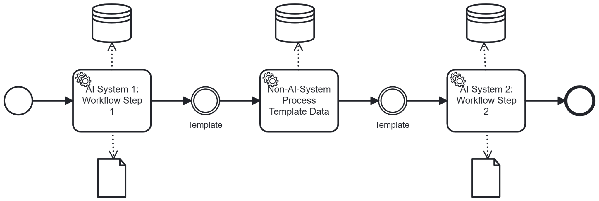

# Fixed Interfaces

## Short Description

AI output is constrained by a predefined template structure. The AI generates content within the bounds of a fixed interface — a template that encodes compliance-relevant requirements as structural constraints. A downstream non-AI validator checks the output syntactically and rule-based before it is passed on.

---

## Problem / Context

When AI systems generate structured output — such as forms, documents, code, or data records — they do so with significant freedom. Without structural constraints, the AI applies its own judgement about what fields, validations, and formats to include.

In compliance-critical business processes (BPs), this freedom is problematic:

- The AI may omit required fields, particularly those that are legally mandated but not explicitly mentioned in the input prompt.
- Basic validation rules (e.g. a date of birth must lie in the past) are frequently missed, even though they are obvious from a domain perspective.
- Cross-cutting compliance concerns — multilingual support, accessibility requirements, data protection notices — are inconsistently applied and hard to verify after the fact.
- Errors in free-form AI output are **difficult to find** (the reviewer does not know where to look) and **difficult to fix** (they are embedded throughout unstructured code or text).

Direct AI generation ("vibe coding") often produces UX-pleasing output that fits the specific use case well — but compliance-relevant errors accumulate below the surface, creating legal and operational risk.

---

## Solution / Structure

Define a **Fixed Interface**: a template that specifies the required structure, fields, data types, validation rules, and cross-cutting concerns for the AI's output. The AI does not generate freely — it fills in and elaborates within the bounds of this interface.

A **non-AI validator** then checks the AI's output against the template rules syntactically and rule-based. This type of validation is highly precise — more precise than human review for low-level constraint checking — and can be automated reliably.

Key design principles:
- **Template encodes compliance knowledge**: The effort of defining compliance requirements is invested once in the template, not repeatedly in prompts or post-hoc reviews. The template becomes the single source of truth for what the output must contain.
- **AI fills, does not design**: The AI's role is to generate content within a structure, not to determine the structure itself. This narrows the AI's degrees of freedom and reduces compliance risk.
- **Non-AI validation is precise and scalable**: Syntactic and rule-based checks (required fields, value ranges, type constraints) are more reliable when performed by a rule engine than by human review.
- **Removing excess is easier than adding missing content**: AI output constrained by a template tends to include more fields than strictly necessary. Removing unnecessary fields is significantly easier than identifying and adding missing ones.
- **Separation of concerns**: The AI and the validation system can be developed, tested, and updated independently.

**Trade-off**: Templates constrain the AI's design freedom. In dimensions not covered by the template (e.g. visual aesthetics, UX flow), direct AI generation may produce better results. The pattern is therefore most valuable where compliance assurance outweighs UX optimisation.

### BPMN Diagram

The AI system generates output within the predefined template structure. A non-AI validator checks the result against the template's rules. Invalid output is rejected and re-prompted. Only validated, template-conformant output is passed to the next BP step.

---

## Related Patterns & Origin

This pattern is an AI-specific adaptation of the following established patterns:

| Origin Pattern | Relationship |
|---|---|
| **Validation and Sanitation Pattern** | The non-AI validator performs the sanitation role; this pattern is itself already a KI-pattern |
| **Facade / Mediator / Bridge / Proxy** | The fixed interface acts as a structural facade between AI generation and downstream consumption |
| **Decoupling Pattern** | The template decouples AI generation logic from the consuming BP step; each can evolve independently |
| **Policy Enforcement Pattern** | Compliance rules are enforced structurally at the interface level, not rely on AI self-compliance |
| **Domain Driven Design** | Template structure reflects domain concepts and constraints explicitly |
| **Case Centric / Document Centric Pattern** | Output is structured around a defined case or document model |
| **Business Process Management (BPM) / Composable Enterprise** | Templates align AI output with composable BP building blocks |

**Validated in case study**: IEdit (compliance-conform application flows for banking products) — the pattern was compared against direct AI generation ("vibe coding"). Quantitative findings:
- Fewer missing required fields with Fixed Interfaces
- Fewer missing or insufficient validations
- Multilingual support achieved exclusively with Fixed Interfaces
- Accessibility (contrast, screen-reader-compatible HTML) covered in multiple dimensions only with Fixed Interfaces

Qualitative conclusion: Fixed Interfaces secured compliance-critical aspects and significantly simplified human review. Direct generation often produced better UX for the specific use case but contained many factual errors — including obvious validation failures (e.g. accepting a future date of birth) — that were hard to identify and harder to fix because they were embedded throughout free-form code.

---
---

# Fixed Interfaces

## Kurzbeschreibung

KI-Output wird durch eine vordefinierte Template-Struktur eingeschränkt. Die KI generiert Inhalte innerhalb der Grenzen einer festen Schnittstelle — eines Templates, das compliance-relevante Anforderungen als strukturelle Constraints kodiert. Ein nachgelagertes Nicht-KI-System prüft den Output syntaktisch und regelbasiert, bevor er weitergegeben wird.

---

## Problem / Kontext

Wenn KI-Systeme strukturierten Output erzeugen — wie Formulare, Dokumente, Code oder Datensätze — tun sie dies mit erheblichem Gestaltungsspielraum. Ohne strukturelle Constraints entscheidet die KI selbst, welche Felder, Validierungen und Formate sie einbezieht.

In compliance-kritischen Geschäftsprozessen (BPs) ist dieser Spielraum problematisch:

- Die KI kann Pflichtfelder auslassen, insbesondere solche, die gesetzlich vorgeschrieben, aber im Eingabe-Prompt nicht explizit erwähnt sind.
- Grundlegende Validierungsregeln (z.B. ein Geburtsdatum muss in der Vergangenheit liegen) werden häufig übersehen, obwohl sie aus fachlicher Sicht offensichtlich sind.
- Übergreifende Compliance-Anforderungen — Mehrsprachigkeit, Barrierefreiheit, Datenschutzhinweise — werden inkonsistent umgesetzt und sind im Nachhinein schwer zu prüfen.
- Fehler in frei generiertem KI-Output sind **schwer zu finden** (der Prüfer weiß nicht, wo er suchen muss) und **schwer zu beheben** (sie sind im unstrukturierten Code oder Text verteilt).

Direkte KI-Generierung ("Vibe Coding") erzeugt oft UX-freundlichen Output, der gut zum spezifischen Anwendungsfall passt — aber compliance-relevante Fehler häufen sich im Verborgenen und erzeugen rechtliche und operative Risiken.

---

## Lösung / Struktur

Ein **Fixed Interface** definieren: ein Template, das die erforderliche Struktur, Felder, Datentypen, Validierungsregeln und übergreifende Anforderungen für den KI-Output festlegt. Die KI generiert nicht frei — sie füllt innerhalb der Grenzen dieser Schnittstelle aus und elaboriert.

Ein **Nicht-KI-Validator** prüft anschließend den KI-Output syntaktisch und regelbasiert gegen die Template-Regeln. Diese Prüfart ist hochpräzise — präziser als menschliche Kontrolle bei der Prüfung von Low-Level-Constraints — und kann zuverlässig automatisiert werden.

Wesentliche Gestaltungsprinzipien:
- **Template kodiert Compliance-Wissen**: Der Aufwand zur Definition von Compliance-Anforderungen wird einmalig ins Template investiert, nicht wiederholt in Prompts oder nachträglichen Reviews. Das Template wird zur Single Source of Truth dafür, was der Output enthalten muss.
- **KI befüllt, gestaltet nicht**: Die Aufgabe der KI ist es, Inhalte innerhalb einer Struktur zu generieren, nicht die Struktur selbst zu bestimmen. Dies begrenzt die Freiheitsgrade der KI und reduziert Compliance-Risiken.
- **Nicht-KI-Validierung ist präzise und skalierbar**: Syntaktische und regelbasierte Prüfungen (Pflichtfelder, Wertebereiche, Typ-Constraints) sind zuverlässiger durch eine Regelmaschine als durch menschliche Kontrolle.
- **Überflüssiges entfernen ist leichter als Fehlendes ergänzen**: KI-Output, der auf ein vorgegebenes  Template zielt, tendiert dazu, mehr Felder als nötig zu enthalten. (Weil die KI oft auch Felder des Templates ausfüllen will, die keine Pflicht sind.) Überflüssige Felder zu entfernen ist wesentlich einfacher als fehlende zu identifizieren und nachzurüsten.
- **Separation of Concerns**: Die KI und das Validierungssystem können unabhängig voneinander entwickelt, getestet und aktualisiert werden.

**Trade-off**: Templates schränken den Gestaltungsspielraum der KI ein. In Dimensionen, die das Template nicht abdeckt (z.B. optische Gestaltung, UX-Fluss), kann direkte KI-Generierung bessere Ergebnisse liefern. Das Pattern ist daher am wertvollsten, wo Compliance-Sicherung über UX-Optimierung gestellt wird.

### BPMN-Darstellung

Das KI-System generiert Output innerhalb der vordefinierten Template-Struktur. Ein Nicht-KI-Validator prüft das Ergebnis gegen die Template-Regeln. Ungültiger Output wird abgelehnt und neu angefordert. Nur validierter, template-konformer Output wird an den nächsten BP-Schritt weitergegeben.

---

## Verwandte Pattern & Herkunft

Dieses Pattern ist eine KI-spezifische Ausprägung der folgenden etablierten Pattern:

| Herkunfts-Pattern | Bezug |
|---|---|
| **Validation and Sanitation Pattern** | Der Nicht-KI-Validator übernimmt die Sanitierungsrolle; dieses Pattern ist selbst bereits ein KI-Pattern |
| **Facade / Mediator / Bridge / Proxy** | Die feste Schnittstelle wirkt als strukturelle Fassade zwischen KI-Generierung und nachgelagerten BP-Schritten |
| **Decoupling Pattern** | Das Template entkoppelt KI-Generierungslogik vom konsumierenden BP-Schritt; beide können unabhängig weiterentwickelt werden |
| **Policy Enforcement Pattern** | Compliance-Regeln werden strukturell auf Schnittstellenebene durchgesetzt — nicht auf KI-Selbst-Compliance vertraut |
| **Domain Driven Design** | Template-Struktur reflektiert Domänenkonzepte und -constraints explizit |
| **Case Centric / Document Centric Pattern** | Output wird um ein definiertes Fall- oder Dokumentenmodell herum strukturiert |
| **Business Process Management (BPM) / Composable Enterprise** | Templates richten KI-Output an wiederverwendbaren BP-Bausteinen aus |

**Validiert im Anwendungsfall**: IEdit (Compliance-konforme Antragsstrecken für Bankprodukte) — das Pattern wurde mit direkter KI-Generierung ("Vibe Coding") verglichen. Quantitative Ergebnisse:
- Weniger fehlende Pflichtfelder bei Fixed Interfaces
- Weniger fehlende oder offensichtlich unzureichende Validierungen
- Mehrsprachigkeit ausschließlich bei Fixed Interfaces erreicht
- Barrierefreiheit (Kontrast, Screenreader-freundliches HTML) in mehreren Aspekten nur bei Fixed Interfaces abgedeckt

Qualitatives Fazit: Fixed Interfaces sicherten compliance-kritische Aspekte und vereinfachten die menschliche Nachbearbeitung erheblich. Direkte Generierung produzierte oft bessere UX für den spezifischen Anwendungsfall, enthielt aber viele sachliche Fehler — darunter offensichtliche Validierungsfehler (z.B. Akzeptanz eines Geburtsdatums in der Zukunft) — die schwer zu identifizieren und noch schwerer zu beheben waren, da sie direkt im frei generierten Code verborgen waren.
