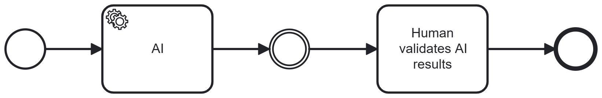

# Human in the Loop

## Short Description

A human reviewer is positioned after an AI processing step to detect and correct errors before results are passed on in the business process. The human acts as both detector and corrector, applying domain knowledge and judgement that the AI may lack.

---

## Problem / Context

AI systems are capable but not fully reliable. In business processes (BPs), AI output flows into downstream systems, decisions, and documents. Without a control mechanism, errors in AI output propagate undetected through the process — potentially creating compliance violations, incorrect customer communications, or flawed decisions.

This is not a new problem. BPs have long handled another type of capable-but-error-prone actor: humans. The same structural challenge — how to detect and correct errors from a capable but unreliable component — has been solved in human-centric workflows through the **four-eyes principle**: an independent second reviewer checks the work before it proceeds.

Human in the Loop applies this proven principle to AI components. It is the default pattern for AI compliance — and can practically always be inserted as an intermediate step after an AI in a business process.

The key challenge is efficiency: a human review step partially offsets the efficiency gains from AI automation. The pattern must therefore be applied deliberately — at points in the BP where a concrete compliance risk justifies the cost of human review.

---

## Solution / Structure

After each AI processing step whose output carries significant compliance risk, insert a human review step. The human:

- **Detects** errors: assesses the AI result against domain knowledge, regulatory requirements, and process context.
- **Corrects** if needed: either edits the AI output directly, or triggers a re-prompt to the AI with correction feedback.
- **Approves**: passes the result forward only once it meets the required quality and compliance standard.

Key design principles:
- **Position at compliance-critical junctions**: Not every AI step requires human review. Apply the pattern where AI errors would have significant downstream impact — particularly at Knowledge → Actions transitions (see Separation of Level).
- **Explicit intermediate results facilitate review**: Human reviewers work more effectively when AI output is structured and explicit. Combine with Separation of Level and Fixed Interfaces to make AI results reviewable.
- **Feedback loop to AI**: Where the human identifies specific errors, structured feedback to the AI (re-prompt) enables correction within the same process instance — rather than requiring full manual rework.
- **AI as colleague, not tool**: The analogy to the four-eyes principle highlights that the AI should be treated like a highly capable but error-prone colleague. The same risk management practices that apply to human actors in regulated BPs apply to AI actors.

### BPMN Diagram

The AI system generates a result. A human reviewer detects errors and either approves or triggers a correction loop. Only human-approved output proceeds to the next BP step.

---

## Related Patterns & Origin

This pattern is an AI-specific adaptation of the following established patterns:

| Origin Pattern | Relationship |
|---|---|
| **Four-Eyes Principle** (Workflow / BPM) | Direct analogy — independent human review of AI output, exactly as applied to human actors in regulated workflows |
| **Validator / Detector** | Human acts as the validation and detection component for AI output |
| **Human-in-the-Loop** (ML Engineering) | Shares the name and concept; here applied specifically to BP compliance contexts |

**See also**: AI in the Loop (Pattern 07) — the inverse pattern, where the AI reviews human output.

**Validated in all three case studies**: Human in the Loop was required in KIMONA, IEdit, and (implicitly) ISA. Key cross-study finding: all forms of AI integration produced results that delivered significant effort reduction and quality improvements — but all required a final human editorial step for correction. The collaboration between AI and human led to better outcomes than either alone. Full reliability without human oversight was not achieved in any case study.

---
---

# Human in the Loop

## Kurzbeschreibung

Ein menschlicher Prüfer ist nach einem KI-Verarbeitungsschritt positioniert, um Fehler zu erkennen und zu korrigieren, bevor Ergebnisse im Geschäftsprozess weitergegeben werden. Der Mensch fungiert als Detector und Corrector und bringt Domänenwissen und Urteilsvermögen ein, das der KI fehlen kann.

---

## Problem / Kontext

KI-Systeme sind leistungsfähig, aber nicht vollständig zuverlässig. In Geschäftsprozessen (BPs) fließt KI-Output in nachgelagerte Systeme, Entscheidungen und Dokumente. Ohne Kontrollmechanismus propagieren Fehler im KI-Output unerkannt durch den Prozess — und erzeugen potenziell Compliance-Verstöße, fehlerhafte Kundenkommunikation oder falsche Entscheidungen.

Dies ist kein neues Problem. BPs haben schon lange mit einem anderen Typ von leistungsfähigen, aber fehleranfälligen Akteuren umzugehen: Menschen. Die gleiche strukturelle Herausforderung — wie Fehler eines leistungsfähigen, aber unzuverlässigen Akteurs erkannt und behoben werden — wurde in menschenzentrischen Workflows durch das **Vier-Augen-Prinzip** gelöst: ein unabhängiger zweiter Prüfer überprüft die Arbeit, bevor sie weitergeht.

Human in the Loop überträgt dieses bewährte Prinzip auf KI-Komponenten. Es ist das Standard-Pattern für KI-Compliance schlechthin. Es kann praktisch überall als Zwischenschritt nach einer KI in einen Geschäftsprozess eingebaut werden.

Die zentrale Herausforderung ist die Effizienz: Ein menschlicher Prüfschritt reduziert die Effizienzgewinne durch KI-Automatisierung teilweise. Das Pattern muss daher bewusst eingesetzt werden — an Stellen im BP, wo ein konkretes Compliance-Risiko den Aufwand einer menschlichen Prüfung rechtfertigt.

---

## Lösung / Struktur

Nach jedem KI-Verarbeitungsschritt, dessen Output ein Compliance-Risiko trägt, wird ein menschlicher Prüfschritt eingefügt. Der Mensch:

- **Erkennt** Fehler: bewertet das KI-Ergebnis anhand von Domänenwissen, regulatorischen Anforderungen und Prozesskontext.
- **Korrigiert** bei Bedarf: bearbeitet den KI-Output direkt oder löst einen Re-Prompt an die KI mit Korrektur-Feedback aus.
- **Genehmigt**: gibt das Ergebnis erst weiter, wenn es dem geforderten Qualitäts- und Compliance-Standard entspricht.

Wesentliche Gestaltungsprinzipien:
- **Positionierung an compliance-kritischen Stellen**: Nicht jeder KI-Schritt erfordert menschliche Prüfung. Das Pattern dort einsetzen, wo KI-Fehler relevante nachgelagerte Auswirkungen hätten — insbesondere an Übergängen der Level "Wissen → Aktionen" (vgl. Separation of Level).
- **Explizite Zwischenergebnisse erleichtern die Prüfung**: Menschliche Prüfer arbeiten effektiver, wenn KI-Output strukturiert und explizit ist. Human in the Loop kann daher mit Separation of Level und Fixed Interfaces kombiniert werden, um KI-Ergebnisse besser prüfbar zu machen.
- **Feedback-Loop zur KI**: Wo der Mensch spezifische Fehler identifiziert, ermöglicht strukturiertes Feedback an die KI (Re-Prompt) eine Korrektur innerhalb derselben Prozessinstanz — statt vollständiger manueller Nacharbeit.
- **KI als Kollege, nicht als Werkzeug**: Die Analogie zum Vier-Augen-Prinzip verdeutlicht, dass die KI wie ein hochleistungsfähiger, aber fehleranfälliger Kollege behandelt werden sollte. Dieselben Risikomanagement-Praktiken, die für menschliche Akteure in regulierten BPs gelten, gelten auch für KI-Akteure.

### BPMN-Darstellung

Das KI-System generiert ein Ergebnis. Ein menschlicher Prüfer erkennt Fehler und genehmigt entweder oder löst einen Korrektur-Loop aus. Nur vom Menschen freigegebener Output geht an den nächsten BP-Schritt weiter.

---

## Verwandte Pattern & Herkunft

Dieses Pattern ist eine KI-spezifische Ausprägung der folgenden etablierten Pattern:

| Herkunfts-Pattern                       | Bezug                                                                                                                                   |
| --------------------------------------- | --------------------------------------------------------------------------------------------------------------------------------------- |
| **Vier-Augen-Prinzip** (Workflow / BPM) | Direkte Analogie — unabhängige menschliche Prüfung von KI-Output, exakt wie auf menschliche Akteure in regulierten Workflows angewendet |
| **Validator / Detector**                | Der Mensch übernimmt die Validierungs- und Erkennungsrolle für KI-Output                                                                |
| **Human-in-the-Loop** (ML Engineering)  | Teilt Namen und Konzept; hier spezifisch auf BP-Compliance-Kontexte angewendet                                                          |

**Siehe auch**: AI in the Loop (Pattern 07) — das inverse Pattern, bei dem die KI den menschlichen Output prüft.

**Validiert in allen drei Fallstudien**: Human in the Loop war in KIMONA, IEdit und (implizit) ISA erforderlich. Zentrale fallstudienübergreifende Erkenntnis: Alle Formen der KI-Einbindung lieferten Ergebnisse, die eine erhebliche Aufwandsreduktion und Qualitätsverbesserungen darstellten — bedurften aber alle einer abschließenden menschlichen Redaktion zur Korrektur. Die Zusammenarbeit zwischen KI und Mensch führte zu besseren Ergebnissen als jeder allein. Eine vollständige Zuverlässigkeit ohne menschliche Kontrolle wurde in keiner Fallstudie erreicht.
