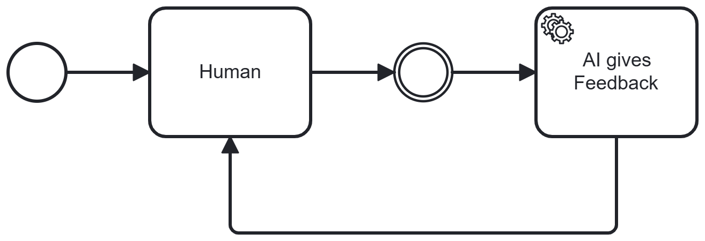

# AI in the Loop

## Short Description

An AI system is positioned after a human processing step to review and provide feedback on human output. The AI acts as a reviewer, flagging unclear points, compliance issues, or gaps — enabling the human to revise before the result is passed on.

---

## Problem / Context

Human in the Loop (Pattern 06) positions a human after an AI step to catch AI errors. AI in the Loop inverts this relationship: the AI reviews human output.

Humans are capable but also error-prone — and in specific areas, AI systematically outperforms human reviewers:

- **Large rule sets and specification documents**: AI can reliably check human output against comprehensive sets of rules, guidelines, or regulatory requirements that are too extensive for a human reviewer to hold in mind simultaneously.
- **Consistency**: AI applies checks uniformly, without fatigue, distraction, or confirmation bias.
- **Cross-cutting concerns**: Requirements like multilingual correctness, accessibility standards, or compliance with formatting specifications are checked exhaustively by AI where humans tend to overlook edge cases.

Without an AI review step, human output that nominally complies with process requirements may contain gaps or errors in dimensions that are hard to check manually — particularly in regulated environments where rule sets are extensive.

---

## Solution / Structure

After a human processing step, insert an AI review step. The AI:

- **Analyses** the human's output against defined criteria (rules, guidelines, specifications, compliance requirements).
- **Flags** issues: identifies unclear points, missing elements, potential compliance violations, or inconsistencies.
- **Returns feedback** to the human, who revises the output accordingly.
- The loop repeats until the AI review finds no further issues — or the human decides that the remaining AI feedback is not relevant.

Key design principles:
- **Define the AI's review criteria explicitly**: The AI review is only as good as the rules and criteria it applies. AI agents are in some cases capable of providing relevant feedback based on their knowledge base even without specific training. However, to address compliance risks in a targeted way, it is advisable to define and maintain clear rules.
- **AI reviews, human decides**: The AI flags issues but does not block the process unilaterally. The human retains final authority — particularly for judgement calls where rules are ambiguous.
- **Complement to Human in the Loop**: In complex BPs, both patterns may be active simultaneously. The AI reviews human drafts; the human reviews AI results. Together, they create a mutual quality assurance loop.
- **AI advantage in rule coverage**: AI in the Loop is most valuable where the review criteria are extensive, formal, and rule-based — areas where AI's capacity to process large specifications outperforms human review.

### BPMN Diagram

The human creates a result. The AI reviews it and returns feedback. The human revises and resubmits. Once the AI review finds no further issues, the result proceeds to the next BP step.

---

## Related Patterns & Origin

This pattern is an AI-specific adaptation of the following established patterns:

| Origin Pattern | Relationship |
|---|---|
| **Loop / Iteration** (BP Basics) | Iterative human–AI feedback loop until quality criteria are met |
| **Validation and Sanitation Pattern** | AI acts as the validation component for human output |
| **Event-Driven Architecture** | AI review can be triggered as an event on human output submission |
| **Event-Sourcing Architecture** | Each revision cycle is logged, providing a traceable audit trail |

**Relationship to Human in the Loop (Pattern 06)**: These two patterns are complementary inverses. Human in the Loop uses human intelligence to catch AI errors; AI in the Loop uses AI's rule-processing capacity to catch human errors. In practice, both are often applied together within the same BP — forming a mutual oversight structure between human and AI actors.

**Validated in case study**: IEdit (compliance-conform application flows) — the AI reviewed human-created application flow specifications and flagged missing validations, accessibility gaps, and multilingual omissions. In this context, AI review was more precise than human review for rule-based compliance criteria.

---
---

# AI in the Loop

## Kurzbeschreibung

Ein KI-System ist nach einem menschlichen Verarbeitungsschritt positioniert, um menschlichen Output zu prüfen und Feedback zu geben. Die KI fungiert als Reviewer und kennzeichnet unklare Punkte, Compliance-Probleme oder Lücken — so kann der Mensch revidieren, bevor das Ergebnis weitergegeben wird.

---

## Problem / Kontext

Human in the Loop (Pattern 06) positioniert einen Menschen nach einem KI-Schritt, um KI-Fehler abzufangen. AI in the Loop kehrt diese Beziehung um: die KI prüft menschlichen Output.

Menschen sind leistungsfähig, aber ebenfalls fehleranfällig — und in spezifischen Bereichen übertrifft KI menschliche Reviewer systematisch:

- **Umfangreiche Regelwerke und Spezifikationsdokumente**: KI kann menschlichen Output zuverlässig gegen umfassende Regelsets, Richtlinien oder regulatorische Anforderungen prüfen, die zu umfangreich sind, um sie von einem menschlichen Prüfer gleichzeitig im Blick zu behalten.
- **Konsistenz**: KI wendet Prüfungen gleichmäßig an — ohne Ermüdung, Ablenkung oder Bestätigungsfehler.
- **Übergreifende Anforderungen**: Anforderungen wie mehrsprachige Korrektheit, Barrierefreiheits-Standards oder Compliance mit Formatierungsspezifikationen werden von KI erschöpfend geprüft, wo Menschen Randfälle übersehen.

Ohne KI-Prüfschritt kann menschlicher Output, der nominell den Prozessanforderungen entspricht, Lücken oder Fehler in Dimensionen enthalten, die manuell schwer prüfbar sind — insbesondere in regulierten Umgebungen mit umfangreichen Regelsets.

---

## Lösung / Struktur

Nach einem menschlichen Verarbeitungsschritt wird ein KI-Prüfschritt eingefügt. Die KI:

- **Analysiert** den menschlichen Output anhand definierter Kriterien (Regeln, Richtlinien, Spezifikationen, Compliance-Anforderungen).
- **Kennzeichnet** Probleme: identifiziert unklare Punkte, fehlende Elemente, potenzielle Compliance-Verstöße oder Inkonsistenzen.
- **Gibt Feedback** an den Menschen zurück, der den Output entsprechend revidiert.
- Der Loop wiederholt sich, bis die KI-Prüfung keine weiteren Probleme findet — oder der Mensch entscheidet, dass die verbliebenen Feedbacks der KI nicht relevant sind.

Wesentliche Gestaltungsprinzipien:
- **KI-Prüfkriterien explizit definieren**: Die KI-Prüfung ist nur so gut wie die Regeln und Kriterien, die sie anwendet. KI-Agenten sind teils in der Lage, anhand ihrer Wissensbasis auch ohne spezifisches Training relevantes Feedback zu geben. Um Compliance-Risiken gezielt zu adressieren, empfiehlt es sich aber, klare Regeln zu definieren und zu pflegen.
- **KI prüft, Mensch entscheidet**: Die KI kennzeichnet Probleme, blockiert den Prozess aber nicht einseitig. Der Mensch behält die letzte Entscheidungsgewalt — insbesondere bei Ermessensfragen, wo Regeln mehrdeutig sind.
- **Ergänzung zu Human in the Loop**: In komplexen BPs können beide Pattern gleichzeitig aktiv sein. Die KI prüft menschliche Entwürfe; der Mensch prüft KI-Ergebnisse. Gemeinsam bilden sie eine gegenseitige Qualitätssicherungsschleife.
- **KI-Vorteil bei Regelabdeckung**: AI in the Loop ist am wertvollsten, wo die Prüfkriterien umfangreich, formal und regelbasiert sind — Bereiche, in denen KIs Kapazität zur Verarbeitung großer Spezifikationen menschliche Prüfung übertrifft.

### BPMN-Darstellung

Der Mensch erstellt ein Ergebnis. Die KI prüft es und gibt Feedback zurück. Der Mensch revidiert und reicht erneut ein. Sobald die KI-Prüfung keine weiteren Probleme findet, geht das Ergebnis an den nächsten BP-Schritt weiter.

---

## Verwandte Pattern & Herkunft

Dieses Pattern ist eine KI-spezifische Ausprägung der folgenden etablierten Pattern:

| Herkunfts-Pattern | Bezug |
|---|---|
| **Loop / Iteration** (BP-Grundlagen) | Iterative Mensch-KI-Feedback-Schleife bis Qualitätskriterien erfüllt sind |
| **Validation and Sanitation Pattern** | KI übernimmt die Validierungsrolle für menschlichen Output |
| **Event-Driven Architecture** | KI-Prüfung kann als Event bei Einreichung von menschlichem Output ausgelöst werden |
| **Event-Sourcing Architecture** | Jeder Revisionszyklus wird protokolliert und liefert einen nachvollziehbaren Audit Trail |

**Beziehung zu Human in the Loop (Pattern 06)**: Diese beiden Pattern sind komplementäre Inverse. Human in the Loop nutzt menschliche Intelligenz, um KI-Fehler abzufangen; AI in the Loop nutzt die Regelverarbeitungskapazität der KI, um menschliche Fehler abzufangen. In der Praxis werden beide oft gemeinsam im selben BP eingesetzt — und bilden so eine gegenseitige Überwachungsstruktur zwischen menschlichen und KI-Akteuren.

**Validiert im Anwendungsfall**: IEdit (Compliance-konforme Antragsstrecken) — die KI prüfte menschlich erstellte Antragsstrecken-Spezifikationen und kennzeichnete fehlende Validierungen, Barrierefreiheitslücken und mehrsprachige Auslassungen. In diesem Kontext war die KI-Prüfung präziser als menschliche Prüfung für regelbasierte Compliance-Kriterien.
