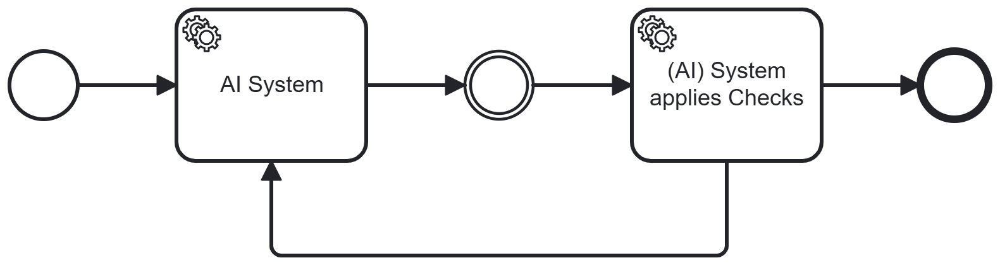

# Validate / Detect

## Short Description

A downstream system — classical or AI-based — applies defined checks to AI output. Validated results are passed forward in the business process. Suspected errors are flagged and routed to a human or AI corrector.

---

## Problem / Context

AI systems are capable but not fully reliable. Without a systematic check on AI output, errors propagate into downstream BP steps — potentially resulting in compliance violations, incorrect decisions, or faulty communications.

Human review (Pattern 06 — Human in the Loop) addresses this, but at significant cost: human review is slow and partially offsets the efficiency gains from AI automation. In many cases, a structured automated check can detect a large proportion of errors faster and more consistently than a human reviewer — particularly for rule-based, syntactic, or semantic constraints.

A further important constraint: **the AI system itself cannot reliably validate its own output**. When the same AI is used for a second self-check step, it tends to reproduce its original errors — even when a different prompt is used and critical re-assessment is explicitly requested. This is because the same underlying knowledge base and model behaviour drives both the generation and the self-review.

---

## Solution / Structure

After an AI processing step, insert a **Validator / Detector** — a downstream system that applies defined checks to the AI's output:

- **Validator**: Confirms that the output meets formal and compliance criteria. Passes validated output forward.
- **Detector**: Identifies potential errors — outputs that do not match expected patterns, violate rules, or exhibit suspicious characteristics.

The checking system can be:
- A **classical rule-based system**: syntactic checks, value range validation, schema conformance, compliance rule matching.
- A **separate AI system**: semantic plausibility checks, consistency review, compliance assessment — using a different model or at minimum a different instance with a distinct knowledge scope (see Semantic Access, Pattern 04).

Suspected errors are not passed forward automatically. They are routed to a human or an automated correction step (see Detect / Correct, Pattern 09).

Key design principles:
- **Separate the generator and the validator**: The validation system must be independent of the generating AI. Using the same AI for self-validation is generally ineffective.
- **Define checks explicitly**: The validator applies defined, maintainable criteria — not ad hoc review. This makes the validation process auditable and improvable over time.
- **Combine with Human in the Loop where needed**: For errors that cannot be resolved automatically, route to human review. The validator thus acts as a triage mechanism, reducing the volume of cases requiring human attention.
- **Position at high-risk junctions**: Validate at points in the BP where AI output flows into consequential downstream steps — particularly before external communications, regulatory submissions, or irreversible actions.

### BPMN Diagram

The AI system generates a result. The Validator / Detector applies checks. Valid output proceeds to the next BP step. Detected errors are routed to a human or AI corrector, which re-prompts the AI or applies a correction before the result re-enters the flow.

---

## Related Patterns & Origin

This pattern is an AI-specific adaptation of the following established patterns:

| Origin Pattern | Relationship |
|---|---|
| **Validation and Sanitation Pattern** | Direct origin — the downstream check system is a specialised validation component for AI output |
| **Loop / Iteration** (BP Basics) | Error detection triggers a correction loop before the result can proceed |
| **Notification** (BP Basics) | Detected errors generate notifications to human reviewers or correction systems |
| **Retry Pattern** | After correction, the AI step is retried with improved input |
| **Compensation Pattern** | If correction is not possible, compensating actions are taken to restore process integrity |
| **BPM Architecture** | The validation step is a first-class BP element, not an afterthought |

**See also**: Detect / Correct (Pattern 09) — extends this pattern by adding automated correction of detected errors before escalating to human review.

**Validated in case study**: ISA (support assistant with AI-based compliance monitoring) — a second AI system was used to monitor the compliance of the primary AI's outputs. Key empirical finding: the pattern effectively reduced the error rate in AI-generated outputs passed to downstream steps, and provided an auditable record of detected issues. The importance of using a *separate* validation system (not self-validation) was confirmed: same-AI self-checks tended to reproduce the original errors.

---
---

# Validate / Detect

## Kurzbeschreibung

Ein nachgelagertes System — klassisch oder KI-basiert — wendet definierte Prüfungen auf KI-Output an. Validierte Ergebnisse werden im Geschäftsprozess weitergegeben. Erkannte Fehler werden zur Korrektur weitergeleitet — an einen Menschen oder ein automatisches Korrektursystem.

---

## Problem / Kontext

KI-Systeme sind leistungsfähig, aber nicht vollständig zuverlässig. Ohne systematische Prüfung von KI-Output propagieren Fehler in nachgelagerte BP-Schritte — und erzeugen potenziell Compliance-Verstöße, fehlerhafte Entscheidungen oder fehlerhafte Kommunikation.

Menschliche Kontrolle (Pattern 06 — Human in the Loop) adressiert dies, ist aber mit erheblichem Aufwand verbunden: Menschliche Prüfung ist langsam und reduziert  die Effizienzgewinne durch KI-Automatisierung. In vielen Fällen kann eine strukturierte automatische Prüfung einen großen Anteil der Fehler schneller und konsistenter erkennen als ein menschlicher Prüfer — insbesondere für regelbasierte Constraints.

Eine weitere wichtige Einschränkung: **Das KI-System kann seinen eigenen Output in der Regel nicht so zuverlässig validieren wie ein separates KI-System mit anderem Modell.** Wenn dieselbe KI für einen zweiten Selbstprüfschritt eingesetzt wird, neigt sie dazu, ihre ursprünglichen Fehler zu reproduzieren — auch wenn ein anderer Prompt verwendet wird und explizit eine kritische Einschätzung des vorigen Ergebnisses gefordert wird. Grund: dieselbe zugrundeliegende Wissensbasis und dasselbe Modellverhalten steuern sowohl die Generierung als auch die Selbstprüfung. Verwendet die prüfende KI ein anderes Modell, verhält sie sich eher anders und findet dadurch eher Fehler.

---

## Lösung / Struktur

Nach einem KI-Verarbeitungsschritt wird ein **Validator / Detector** eingefügt — ein nachgelagertes System, das definierte Prüfungen auf den KI-Output anwendet:

- **Validator**: Bestätigt, dass der Output formale und Compliance-Kriterien erfüllt. Validierter Output wird weitergegeben.
- **Detector**: Identifiziert potenzielle Fehler — Output, der nicht den erwarteten Mustern entspricht, Regeln verletzt oder verdächtige Merkmale aufweist.

Das Prüfsystem kann sein:
- Ein **klassisches regelbasiertes System**: syntaktische Prüfungen, Wertebereichsvalidierung, Schema-Konformität, Compliance-Regelabgleich.
- Ein **separates KI-System**: semantische Plausibilitätsprüfungen, Konsistenzprüfung, Compliance-Bewertung — mit einem anderen Modell oder zumindest einer anderen Instanz mit eigenem Wissensbereich (vgl. Semantic Access, Pattern 04).

Vermutete Fehler werden nicht automatisch weitergeleitet. Sie werden an einen Menschen oder ein automatisches Korrektursystem übergeben (vgl. Detect / Correct, Pattern 09).

Wesentliche Gestaltungsprinzipien:
- **Generator und Validator trennen**: Das Validierungssystem soll unabhängig von der generierenden KI sein. Dieselbe KI für die Selbstvalidierung einzusetzen ist in der Regel weniger wirksam.
- **Prüfungen explizit definieren**: Der Validator wendet definierte, wartbare Kriterien an — keine Ad-hoc-Prüfung. Dies macht den Validierungsprozess auditierbar und verbesserbar.
- **Mit Human in the Loop kombinieren**: Für Fehler, die nicht automatisch behoben werden können, wird an menschliche Prüfung übergeleitet. Der Validator wirkt so als Triagemechanismus und reduziert das Volumen der Fälle, die menschliche Aufmerksamkeit erfordern.
- **An Hochrisiko-Übergängen positionieren**: Validierung an Stellen im BP einsetzen, wo KI-Output in folgenreiche nachgelagerte Schritte fließt — insbesondere vor externen Kommunikationen, regulatorischen Einreichungen oder irreversiblen Aktionen.

### BPMN-Darstellung

Das KI-System generiert ein Ergebnis. Der Validator / Detector wendet Prüfungen an. Gültiger Output geht an den nächsten BP-Schritt weiter. Erkannte Fehler werden an einen menschlichen oder KI-Korrektor weitergeleitet, der die KI neu ansteuert oder eine Korrektur anwendet, bevor das Ergebnis den Fluss wieder eintritt.

---

## Verwandte Pattern & Herkunft

Dieses Pattern ist eine KI-spezifische Ausprägung der folgenden etablierten Pattern:

| Herkunfts-Pattern                     | Bezug                                                                                                                     |
| ------------------------------------- | ------------------------------------------------------------------------------------------------------------------------- |
| **Validation and Sanitation Pattern** | Direkter Ursprung — das nachgelagerte Prüfsystem ist eine spezialisierte Validierungskomponente für KI-Output             |
| **Loop / Iteration** (BP-Grundlagen)  | Fehlererkennung löst einen Korrektur-Loop aus, bevor das Ergebnis weitergehen kann                                        |
| **Notification** (BP-Grundlagen)      | Erkannte Fehler erzeugen Benachrichtigungen an menschliche Prüfer oder Korrektursysteme                                   |
| **Retry Pattern**                     | Nach Korrektur wird der KI-Schritt mit verbessertem Input wiederholt                                                      |
| **Compensation Pattern**              | Wenn Korrektur nicht möglich ist, werden kompensierende Aktionen eingeleitet, um die Prozessintegrität wiederherzustellen |
| **BPM Architecture**                  | Der Validierungsschritt ist ein erstklassiges BP-Element, kein nachträglicher Zusatz                                      |

**Siehe auch**: Detect / Correct (Pattern 09) — erweitert dieses Pattern um automatische Korrektur erkannter Fehler, bevor an menschliche Prüfung eskaliert wird.

**Validiert im Anwendungsfall**: ISA (Support-Assistent mit KI-basierter Compliance-Überwachung) — ein zweites KI-System überwachte die Compliance der Outputs des primären KI-Systems. Zentrale empirische Erkenntnis: Das Pattern reduzierte effektiv die Fehlerquote in KI-generierten Outputs, die an nachgelagerte Schritte weitergegeben wurden, und lieferte ein auditierbares Protokoll erkannter Probleme. Die Wirksamkeit eines *separaten* Validierungssystems (keine Selbstvalidierung) wurde bestätigt: Selbstprüfungen durch dieselbe KI tendierten dazu, die ursprünglichen Fehler zu reproduzieren.
