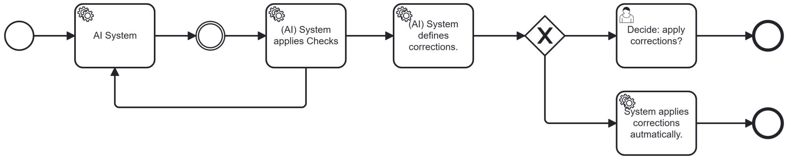

# Detect / Correct

## Short Description

A downstream system detects errors in AI output and actively searches for corrections. High-plausibility corrections are applied automatically. Low-plausibility corrections are escalated to human decision. This pattern extends Validate / Detect (Pattern 08) by adding an active correction step.

---

## Problem / Context

Validate / Detect (Pattern 08) identifies errors in AI output and routes them to correction. But routing every detected error to human review is costly — and in many cases, the correction is deterministic or highly predictable. A system that can not only detect errors but also propose and apply corrections reduces the human review burden while maintaining compliance assurance.

The key challenge is **correction confidence**: automated correction is only safe when the correction is highly plausible — i.e. when the system is confident that the proposed correction is correct and will not introduce a new error. Where confidence is low, the decision must be escalated to a human.

---

## Solution / Structure

Extend the Validator / Detector with a **Corrector** component:

1. The Detector identifies a suspected error in AI output.
2. The Corrector searches for a possible correction — applying rules, lookup tables, alternative AI inference, or constraint-based repair.
3. The Corrector assesses the **plausibility** of the proposed correction:
   - **High plausibility**: the correction is applied automatically. The corrected result proceeds in the BP.
   - **Low plausibility**: the correction proposal is presented to a human decision-maker, who accepts, modifies, or rejects it.

Key design principles:
- **Plausibility threshold as a design parameter**: The threshold for automatic vs. human-escalated correction must be defined explicitly and tuned to the compliance requirements of the BP. In high-stakes contexts, the threshold should be conservative.
- **Audit trail for all corrections**: Whether applied automatically or by human decision, all corrections should be logged with the original AI output, the detected error, the proposed correction, and the resolution. This provides compliance evidence and supports model improvement.
- **Human retains final authority**: The pattern never overrides human judgement for low-confidence corrections. The human can reject the proposed correction entirely and trigger a full re-processing.
- **Layered with Validate / Detect**: Detect / Correct is a direct extension of Pattern 08. Both patterns may be deployed together: the Validator flags structural errors (Pattern 08), the Corrector handles semantic or content errors where automated repair is feasible.

### BPMN Diagram

The Detector / Corrector analyses AI output, finds potential corrections, and assesses plausibility. High-plausibility corrections are applied automatically. Low-plausibility cases are escalated to human decision, whose resolution is then merged back into the BP flow.

---

## Related Patterns & Origin

This pattern is an AI-specific adaptation of the following established patterns:

| Origin Pattern | Relationship |
|---|---|
| **Validate / Detect** (AI-EAIP #8) | Direct extension — adds automated correction to the detection step |
| **Compensation Pattern** ("Cancel") | Correction reverses or compensates an erroneous AI action |
| **Retry Pattern** | Successful correction triggers a retry of the downstream BP step with the corrected input |
| **Notification** (BP Basics) | Low-plausibility corrections generate escalation notifications to human decision-makers |
| **Loop / Iteration** (BP Basics) | The correction cycle is a structured iteration loop within the BP |
| **BPM Architecture** | Both detection and correction are modelled as explicit, auditable BP steps |

**Validated in case study**: ISA (support assistant with AI-based compliance monitoring) — the AI-based compliance monitoring system not only detected non-compliant outputs but also proposed corrections where deterministic repair was possible. The distinction between high- and low-confidence corrections, and the corresponding routing logic, was a key design element of the ISA implementation.

---
---

# Detect / Correct

## Kurzbeschreibung

Ein nachgelagertes System erkennt Fehler im KI-Output und sucht aktiv nach Korrekturen. Korrekturen mit hoher Plausibilität werden automatisch angewendet. Korrekturen mit geringer Plausibilität werden an einen menschlichen Entscheider eskaliert. Dieses Pattern erweitert Validate / Detect (Pattern 08) um einen aktiven Korrekturschritt.

---

## Problem / Kontext

Validate / Detect (Pattern 08) identifiziert Fehler im KI-Output und leitet sie zur Korrektur weiter. Aber jeden erkannten Fehler an menschliche Prüfung zu übergeben ist aufwändig — und in vielen Fällen ist die Korrektur deterministisch oder mit sehr hoher Wahrscheinlichkeit definierbar. Ein System, das Fehler nicht nur erkennen, sondern auch Korrekturen vorschlagen und anwenden kann, reduziert den menschlichen Prüfaufwand bei gleichzeitiger Compliance-Sicherung.

Die zentrale Herausforderung ist das **Korrekturvertrauen**: Automatische Korrektur ist nur sicher, wenn die Korrektur hochplausibel ist — d.h. wenn das System hinreichend sicher ist, dass die vorgeschlagene Korrektur korrekt ist und keinen neuen Fehler einführt. Wo die Konfidenz gering ist, muss die Entscheidung an einen Menschen eskaliert werden.

---

## Lösung / Struktur

Den Validator / Detector um eine **Corrector**-Komponente erweitern:

1. Der Detector identifiziert einen vermuteten Fehler im KI-Output.
2. Der Corrector sucht nach einer möglichen Korrektur — unter Anwendung von Regeln, Lookup-Tabellen, alternativer KI-Inferenz oder constraint-basierter Reparatur.
3. Der Corrector bewertet die **Plausibilität** der vorgeschlagenen Korrektur:
   - **Hohe Plausibilität**: Die Korrektur wird automatisch angewendet. Das korrigierte Ergebnis geht im BP weiter.
   - **Geringe Plausibilität**: Der Korrekturvorschlag wird einem menschlichen Entscheider vorgelegt, der ihn akzeptiert, modifiziert oder ablehnt.

Wesentliche Gestaltungsprinzipien:
- **Plausibilitätsschwelle als Designparameter**: Der Schwellenwert für automatische vs. menschlich eskalierte Korrektur muss explizit definiert und auf die Compliance-Anforderungen des BPs abgestimmt werden. In wesentlichen Kontexten sollte der Schwellenwert konservativ sein.
- **Audit Trail für alle Korrekturen**: Ob automatisch angewendet oder durch menschliche Entscheidung — alle Korrekturen sollten protokolliert werden, mit dem ursprünglichen KI-Output, dem erkannten Fehler, dem Korrekturvorschlag und der Auflösung. Dies liefert Compliance-Nachweise und unterstützt die Modellverbesserung.
- **Mensch behält letzte Entscheidungsgewalt**: Das Pattern überschreibt nie das menschliche Urteil bei Korrekturen mit geringer Konfidenz. Der Mensch kann den Korrekturvorschlag vollständig ablehnen und eine vollständige Neuverarbeitung auslösen.
- **Schichtung mit Validate / Detect**: Detect / Correct ist eine direkte Erweiterung von Pattern 08. Beide Pattern können gemeinsam eingesetzt werden: Der Validator kennzeichnet strukturelle Fehler (Pattern 08), der Corrector behandelt semantische oder inhaltliche Fehler, bei denen automatische Reparatur machbar ist.

### BPMN-Darstellung

Der Detector / Corrector analysiert KI-Output, findet potenzielle Korrekturen und bewertet die Plausibilität. Korrekturen mit hoher Plausibilität werden automatisch angewendet. Fälle mit geringer Plausibilität werden an einen menschlichen Entscheider eskaliert, dessen Entscheidung dann in den BP-Fluss zurückgeführt wird.

---

## Verwandte Pattern & Herkunft

Dieses Pattern ist eine KI-spezifische Ausprägung der folgenden etablierten Pattern:

| Herkunfts-Pattern                       | Bezug                                                                                                       |
| --------------------------------------- | ----------------------------------------------------------------------------------------------------------- |
| **Validate / Detect** (KI-EAIP #8)      | Direkte Erweiterung — fügt dem Erkennungsschritt eine automatische Korrektur hinzu                          |
| **Compensation Pattern** ("Stornieren") | Korrektur macht eine fehlerhafte KI-Aktion rückgängig oder kompensiert sie                                  |
| **Retry Pattern**                       | Erfolgreiche Korrektur löst eine Wiederholung des nachgelagerten BP-Schritts mit dem korrigierten Input aus |
| **Notification** (BP-Grundlagen)        | Korrekturen mit geringer Plausibilität erzeugen Eskalationsbenachrichtigungen an menschliche Entscheider    |
| **Loop / Iteration** (BP-Grundlagen)    | Der Korrekturzyklus ist eine strukturierte Iterationsschleife im BP                                         |
| **BPM Architecture**                    | Sowohl Erkennung als auch Korrektur werden als explizite, auditierbare BP-Schritte modelliert               |

**Validiert im Anwendungsfall**: ISA (Support-Assistent mit KI-basierter Compliance-Überwachung) — das KI-basierte Compliance-Überwachungssystem erkannte nicht nur nicht-konforme Outputs, sondern schlug auch Korrekturen vor, wo deterministische Reparatur möglich war.
