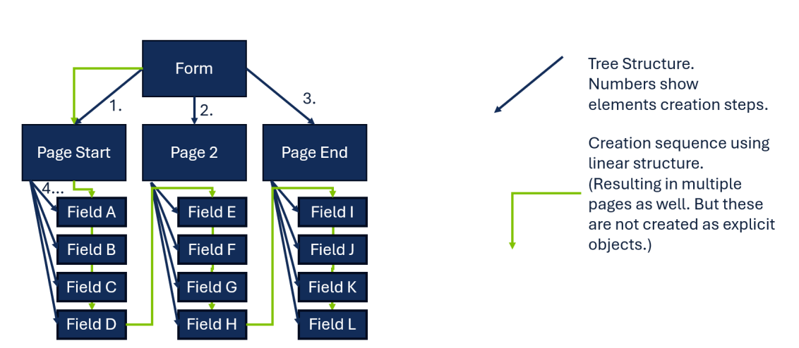
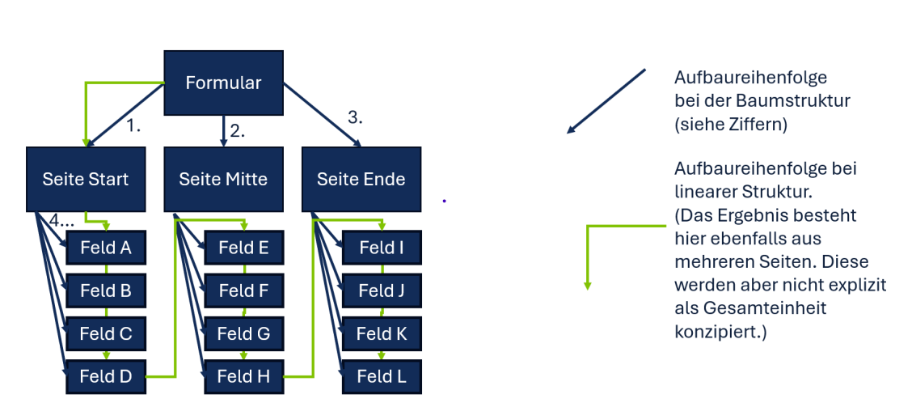

# Agentic Subworkflow Structures

## Short Description

When an AI agent executes multiple business process steps autonomously, its scope of action is bounded as a defined sub-workflow within the larger BP. Within this boundary, two structural decisions must be made: how to sequence the agent's build-up of complex results (Bottom-Up vs. Top-Down), and how to organise the internal structure of the agent's output (Tree vs. Linear).

---

## Problem / Context

Agentic AI represents a qualitative leap beyond single-step AI processing. An AI agent creates a plan and executes multiple steps autonomously — determining the sequence itself. This dramatically expands AI capability and enables the solution of complex, multi-step tasks that single-step AI cannot address.

But this expanded autonomy also expands risk:
- The more steps an agent executes independently, the wider the potential impact on the overall BP if errors occur or the agent pursues an unintended path.
- Agentic AI that has broad, loosely-bounded access to data and systems throughout a BP creates complex dependency graphs ("dotted lines") that make it difficult to understand what the agent is doing, isolate errors, and assess the impact of changes to connected systems.
- Without structural guidance on *how* to build up complex results, agentic AI tends to attempt overly ambitious plans from the outset — which frequently fail because high-level plans are made without sufficient knowledge of the constraints at the detailed level.

This pattern addresses three related structural decisions:

1. **Sub-Workflow Boundary**: How much of the BP should the agent be allowed to influence?
2. **Bottom-Up vs. Top-Down**: In which direction should the agent build up complex results?
3. **Tree Structure vs. Linear Structure**: How should the internal structure of the agent's output be organised?

---

## Solution / Structure

### Sub-Workflow Boundary

Define the AI agent's scope of action as a clearly delimited sub-workflow within the larger BP. The agent may autonomously execute the steps *within* this sub-workflow, but its access to data, systems, and workflow steps *outside* the sub-workflow boundary is restricted.

Design the boundary so that it has minimal "dotted lines" — i.e. minimal data and information dependencies on systems that appear elsewhere in the BP. The sub-workflow should be as self-contained as possible.

Benefits:
- The AI agent's impact on the overall BP is bounded and predictable.
- Errors can be localised to the sub-workflow.
- When connected systems change, it is clear which parts of the BP are affected.

### Bottom-Up vs. Top-Down

When an agent must build up a complex multi-level result (e.g. a complete form, a document, a structured output), two approaches are possible:

**Bottom-Up** (recommended):
The agent is first enabled — through prompt engineering, RAG, or fine-tuning — to reliably execute the *smallest* individual steps (e.g. generating individual fields). Building on this mastery, it progresses to larger compositions (e.g. field groups / pages), and finally to the complete structure. Each level is mastered before the next is attempted.

**Top-Down** (feasible but less reliable):
The agent first creates an overall plan or structure, then progressively refines it into smaller components. The risk: the high-level plan is made without knowledge of the constraints that apply at the detailed level (e.g. specific field formats and validation rules). The plan may pursue a direction that ultimately cannot be completed as specified.

Empirical finding: Bottom-Up produced more reliable results in the IEdit case study. This approach does not follow the "orthodox" agentic AI methodology, but it produces better compliance outcomes. The Bottom-Up approach naturally gives rise to an AI Sub-Workflow structure.

### Tree Structure vs. Linear Structure

Once the agent's build-up direction is defined, a second structural choice concerns the internal organisation of the output:

**Tree Structure**:
The output is organised hierarchically — e.g. Form → Pages → Fields. Each refinement step operates on a manageable number of sub-nodes at its level. This requires abstract descriptions of intermediate levels to exist.

In practice, specifications typically provide lists of the smallest elements (fields) — not abstract descriptions of higher-level groupings (pages, sections). This makes tree structures harder to implement directly from available specifications.

Tree structures are well-suited to **visual presentation formats** (e.g. a 2D form editor with pages and fields displayed spatially).

**Linear Structure**:
The output is assembled step by step from start to finish, without an explicit higher-level model. Each element is added sequentially. No abstract intermediate-level descriptions are required — the agent works directly from field-level specifications.

Linear structures are more practical in most real-world cases because specifications are typically available at the field level. They are well-suited to **conversational / chat-based presentation formats** (sequential dialogue flow).

Empirical finding: both structures produce valid results when matched to the appropriate presentation format.

### BPMN Diagram

Three structural decisions for agentic AI in BPs: (1) Sub-workflow boundary limits agent scope and minimises external dependencies. (2) Bottom-Up composition builds from smallest reliable steps upward. (3) Linear structure is more practical than tree structure when abstract intermediate-level descriptions are unavailable.

---

## Related Patterns & Origin

This pattern is an AI-specific adaptation of the following established patterns:

| Origin Pattern | Relationship |
|---|---|
| **Sub-Workflow** (BP Basics) | The AI agent's scope maps directly to a defined BP sub-workflow with clear entry/exit points |
| **Aggregation** (BP Basics) | Bottom-Up composition aggregates smaller results into larger structures |
| **Command Pattern** | Each agent step is a discrete, well-defined command with bounded effects |
| **Decoupling Pattern** | Sub-workflow boundary minimises coupling between the agent and external BP components |
| **Strategy Pattern** | Bottom-Up vs. Top-Down are alternative strategies for building complex agent outputs |
| **Service-Oriented Architecture (SOA)** | The agent sub-workflow exposes a defined service interface to the surrounding BP |
| **BPM Architecture / Composable Enterprise** | Sub-workflows are composable BP building blocks, applicable to both human and AI actors |

**Validated in case studies**:

*IEdit (compliance-conform application flows)*:
- Bottom-Up approach confirmed as more reliable than Top-Down. Top-Down plans proceeded without knowledge of field-level constraints and led to dead-ends.
- Build sequence: individual fields → pages → prompt refinement → complete form.
- Both tree and linear structures produced valid results when matched to appropriate presentation formats (2D visual editor vs. chat-based).
- Fine-tuning was not required; prompt engineering with RAG was sufficient to enable reliable small-step execution.

*Theoretical validation*: For process-knowledge (PK) models, metric-based analysis confirms that the delimitation of agent steps as a distinct sub-workflow leads to a more stable overall BP. This holds for AI agents executing multiple BP steps autonomously.

---
---

# Agentic Subworkflow Structures

## Kurzbeschreibung

Wenn ein KI-Agent mehrere Geschäftsprozessschritte autonom ausführt, wird sein Wirkungsbereich als definierter Sub-Workflow innerhalb des übergeordneten BP abgegrenzt. Innerhalb dieser Abgrenzung sind zwei strukturelle Entscheidungen zu treffen: wie der Agent komplexe Ergebnisse aufbaut (Bottom-Up vs. Top-Down) und wie die interne Struktur des Agent-Outputs organisiert wird (Baumstruktur vs. Lineare Struktur).

---

## Problem / Kontext

Agentic AI stellt einen qualitativen Sprung gegenüber einschrittigem KI-Einsatz dar. Ein KI-Agent erstellt einen Plan und führt mehrere Schritte autonom aus — die Abfolge legt er selbständig fest. Dies erweitert die Fähigkeiten der KI erheblich und ermöglicht die Lösung komplexer, mehrstufiger Aufgaben.

Aber diese erweiterte Autonomie erweitert auch das Risiko:
- Je mehr Schritte ein Agent eigenständig ausführt, desto größer der potenzielle Einfluss auf den gesamten BP, wenn Fehler auftreten oder der Agent einen unbeabsichtigten Weg einschlägt.
- Agentic AI mit breitem, locker abgegrenztem Zugriff auf Daten und Systeme im gesamten BP erzeugt komplexe Abhängigkeitsgraphen ("dotted lines"), die es schwer machen zu verstehen, was der Agent tut, Fehler zu isolieren und die Auswirkungen von Änderungen an verbundenen Systemen zu bewerten.
- Ohne strukturelle Leitlinien dazu, *wie* komplexe Ergebnisse aufgebaut werden sollen, neigt Agentic AI zu übermäßig ambitionierten Plänen von Anfang an — die häufig scheitern, weil Pläne auf hoher Ebene ohne ausreichende Kenntnis der Constraints auf der Detailebene erstellt werden.

Dieses Pattern adressiert drei zusammenhängende strukturelle Entscheidungen:

1. **Sub-Workflow-Abgrenzung**: Wie viel des BPs soll der Agent beeinflussen dürfen?
2. **Bottom-Up vs. Top-Down**: In welcher Richtung soll der Agent komplexe Ergebnisse aufbauen?
3. **Baumstruktur vs. Lineare Struktur**: Wie soll die interne Struktur des Agent-Outputs organisiert sein?

---

## Lösung / Struktur

### Sub-Workflow-Abgrenzung

Den Wirkungsbereich des KI-Agents als klar abgegrenzten Sub-Workflow innerhalb des übergeordneten BPs definieren. Der Agent darf die Schritte *innerhalb* dieses Sub-Workflows autonom ausführen, aber keine Workflowschritte *außerhalb* der Sub-Workflow-Grenze ist jedoch eingeschränkt. Sein Zugriff auf Daten und Systeme ist entsprechend eingeschränkt.

Die Abgrenzung so gestalten, dass sie möglichst wenig "dotted lines" aufweist — d.h. möglichst wenige Daten- und Informationsbeziehungen zu Systemen, die an anderer Stelle im BP vorkommen. Der Sub-Workflow soll so autark wie möglich sein.

Vorteile:
- Der Einfluss des KI-Agents auf den gesamten BP ist begrenzt und vorhersehbar.
- Fehler lassen sich auf den Sub-Workflow lokalisieren.
- Wenn sich verbundene Systeme ändern, ist klar, welche Teile des BPs betroffen sind.

### Bottom-Up vs. Top-Down

Wenn ein Agent ein komplexes mehrstufiges Ergebnis aufbauen muss (z.B. ein vollständiges Formular, ein Dokument, einen strukturierten Output), sind zwei Herangehensweisen möglich:

**Bottom-Up** (empfohlen):
Der Agent wird zunächst — durch Prompt Engineering, RAG oder Fine-Tuning — befähigt, die *kleinsten* Einzelschritte zuverlässig auszuführen (z.B. einzelne Felder generieren). Aufbauend auf dieser Beherrschung schreitet er zu größeren Kompositionen fort (z.B. Feldgruppen / Seiten) und schließlich zur Gesamtstruktur. Jede Ebene wird beherrscht, bevor die nächste angegangen wird.

**Top-Down** (machbar, aber weniger zuverlässig):
Der Agent erstellt zunächst einen Gesamtplan oder eine Gesamtstruktur und verfeinert diese schrittweise in kleinere Komponenten. Das Risiko: Der Gesamtplan wird ohne Kenntnis der Constraints erstellt, die auf der Detailebene gelten (z.B. spezifische Feldformate und Validierungsregeln). Der Plan kann eine Richtung einschlagen, die letztlich nicht wie spezifiziert abgeschlossen werden kann.

Empirische Erkenntnis: Der Bottom-Up-Ansatz lieferte im IEdit-Anwendungsfall zuverlässigere Ergebnisse. Dieses Vorgehen entspricht nicht der "reinen Lehre" der Agentic AI, produziert aber bessere Compliance-Ergebnisse. Der Bottom-Up-Ansatz ergibt natürlicherweise eine AI-Sub-Workflow-Struktur.

### Baumstruktur vs. Lineare Struktur

Sobald die Aufbaurichtung des Agents definiert ist, betrifft eine zweite strukturelle Entscheidung die interne Organisation des Outputs:

**Baumstruktur**:
Der Output ist hierarchisch organisiert — z.B. Formular → Seiten → Felder. Jeder Verfeinerungsschritt operiert mit einer überschaubaren Anzahl von Sub-Knoten auf seiner Ebene. Dies setzt voraus, dass abstrakte Beschreibungen der Zwischenebenen vorliegen.

In der Praxis stellen Spezifikationen typischerweise Listen der kleinsten Elemente (Felder) zur Verfügung — keine abstrakten Beschreibungen höherstufiger Gruppierungen (Seiten, Abschnitte). Dies macht Baumstrukturen schwerer direkt aus verfügbaren Spezifikationen zu implementieren.

Baumstrukturen eignen sich gut für **visuelle Präsentationsformate** (z.B. ein 2D-Formular-Editor mit räumlich dargestellten Seiten und Feldern).

**Lineare Struktur**:
Der Output wird Schritt für Schritt von Anfang bis Ende zusammengesetzt, ohne explizites Modell auf höherer Ebene. Jedes Element wird sequenziell hinzugefügt. Abstrakte Beschreibungen auf Zwischenebenen sind nicht erforderlich — der Agent arbeitet direkt aus Spezifikationen auf Feldebene.

Lineare Strukturen sind in den meisten realen Fällen praktikabler, da Spezifikationen typischerweise auf Feldebene vorliegen. Sie eignen sich gut für **gesprächsbasierte / Chat-Präsentationsformate** (sequenzieller Dialogablauf).

Empirische Erkenntnis: Beide Strukturen liefern valide Ergebnisse, wenn sie dem passenden Präsentationsformat zugeordnet werden.

### BPMN-Darstellung

Drei strukturelle Entscheidungen für Agentic AI in BPs: (1) Sub-Workflow-Abgrenzung begrenzt den Agent-Wirkungsbereich und minimiert externe Abhängigkeiten. (2) Bottom-Up-Komposition baut von den kleinsten zuverlässigen Schritten aufwärts. (3) Lineare Struktur ist praktikabler als Baumstruktur, wenn abstrakte Beschreibungen auf Zwischenebenen nicht vorliegen.

---

## Verwandte Pattern & Herkunft

Dieses Pattern ist eine KI-spezifische Ausprägung der folgenden etablierten Pattern:

| Herkunfts-Pattern | Bezug |
|---|---|
| **Sub-Workflow** (BP-Grundlagen) | Der Wirkungsbereich des KI-Agents entspricht direkt einem definierten BP-Sub-Workflow mit klaren Ein-/Ausgangspunkten |
| **Aggregation** (BP-Grundlagen) | Bottom-Up-Komposition aggregiert kleinere Ergebnisse zu größeren Strukturen |
| **Command Pattern** | Jeder Agent-Schritt ist ein diskreter, klar definierter Befehl mit begrenzten Auswirkungen |
| **Decoupling Pattern** | Die Sub-Workflow-Abgrenzung minimiert die Kopplung zwischen dem Agent und externen BP-Komponenten |
| **Strategy Pattern** | Bottom-Up vs. Top-Down sind alternative Strategien für den Aufbau komplexer Agent-Outputs |
| **Service-Oriented Architecture (SOA)** | Der Agent-Sub-Workflow stellt dem umgebenden BP eine definierte Service-Schnittstelle bereit |
| **BPM Architecture / Composable Enterprise** | Sub-Workflows sind wiederverwendbare BP-Bausteine, anwendbar auf menschliche wie KI-Akteure |

**Validiert in Fallstudien**:

*IEdit (Compliance-konforme Antragsstrecken)*:
- Bottom-Up-Ansatz als zuverlässiger als Top-Down bestätigt. Top-Down-Pläne wurden ohne Kenntnis der Constraints auf Feldebene erstellt und führten in Sackgassen.
- Aufbauabfolge: Einzelne Felder → Seiten → Prompt-Verfeinerung → Gesamtformular.
- Sowohl Baum- als auch lineare Strukturen lieferten valide Ergebnisse, wenn sie dem passenden Präsentationsformat zugeordnet wurden (2D visueller Editor vs. Chat-basiert).

*Theoretische Validierung*: Für Prozesswissen-(PK-)Modelle bestätigt die Metrik-basierte Analyse, dass die Abgrenzbarkeit von Agent-Schritten als eigenständiger Sub-Workflow zu einem stabileren Gesamt-BP führt. Dies gilt auch für KIs, die mehrere BP-Schritte in Eigenregie ausführen.
